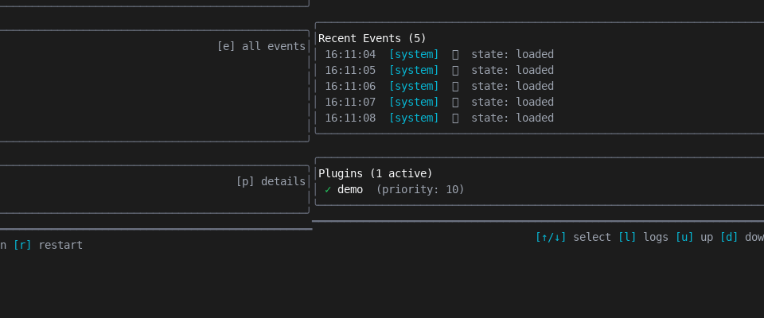
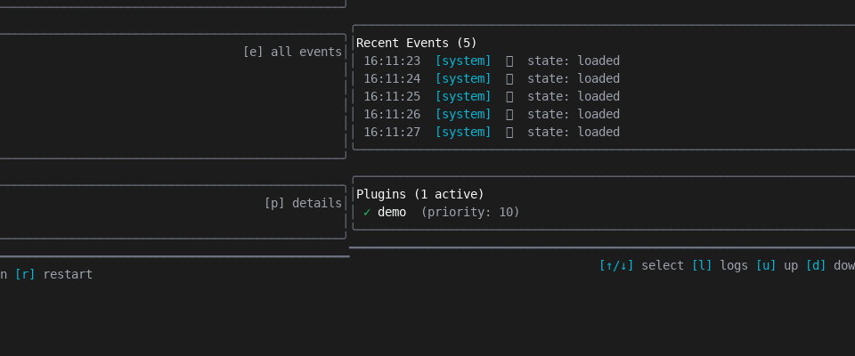

# devctl — Dev Environment Orchestrator

**devctl** makes starting your development environment as simple as `devctl up`.

Instead of remembering which services to start, what order they need, and what environment variables to set, you write a small script (a "plugin") that describes your environment — and devctl handles the rest.

<p align="center">
  
</p>

## The Problem

Starting a development environment often looks like this:

```bash
# Terminal 1: Start the database
docker-compose up -d postgres
sleep 5  # wait for it...

# Terminal 2: Run migrations
cd backend && make migrate

# Terminal 3: Start the API
export DATABASE_URL=postgres://...
go run ./cmd/api

# Terminal 4: Start the frontend  
cd frontend && npm run dev

# Oh, and don't forget to set these env vars...
# And restart the API if you change config...
```

This knowledge lives in your head, in scattered README files, or in tribal knowledge. New team members struggle. You forget steps after a vacation.

## The Solution

With devctl, you write a **plugin** — a simple script that answers three questions:

1. **What configuration does my environment need?** (ports, env vars, etc.)
2. **Is everything ready?** (dependencies installed, database running, etc.)
3. **What services should run?** (API server, frontend, workers, etc.)

Then starting your environment becomes:

```bash
devctl up      # Start everything
devctl status  # See what's running
devctl down    # Stop everything
```

## What's a Plugin?

A plugin is just a script (Python, Bash, Node — any language) that communicates with devctl via JSON messages. It's not a framework or SDK — it's a simple protocol.

Here's the mental model:

```
┌─────────────────────────────────────────────────────────────────┐
│  Your Repository                                                 │
│  ┌──────────────────┐    ┌──────────────────────────────────┐   │
│  │  .devctl.yaml    │    │  devctl-plugin.py (or .sh, .js)  │   │
│  │  ───────────     │    │  ────────────────                │   │
│  │  Points to your  │───▶│  Answers questions about your   │   │
│  │  plugin script   │    │  environment (config, services)  │   │
│  └──────────────────┘    └──────────────────────────────────┘   │
└─────────────────────────────────────────────────────────────────┘
                                      │
                                      ▼
┌─────────────────────────────────────────────────────────────────┐
│  devctl                                                          │
│  ───────                                                         │
│  • Asks your plugin what to run                                  │
│  • Starts services in the right order                            │
│  • Manages logs, health checks, restarts                         │
│  • Provides TUI dashboard and CLI                                │
└─────────────────────────────────────────────────────────────────┘
```

**The plugin describes WHAT to run. devctl handles HOW to run it.**

## Quick Start

### 1. Install devctl

```bash
# macOS
brew tap go-go-golems/go-go-go
brew install go-go-golems/go-go-go/devctl

# Or with Go
go install github.com/go-go-golems/devctl/cmd/devctl@latest
```

(See [Installation](#installation) for more options.)

### 2. Create a config file

In your project root, create `.devctl.yaml`:

```yaml
plugins:
  - id: myproject
    path: python3
    args: [./devctl-plugin.py]
    priority: 10
```

This tells devctl: "Run my plugin using `python3 ./devctl-plugin.py`".

### 3. Write your plugin

Create `devctl-plugin.py`:

```python
#!/usr/bin/env python3
"""
A minimal devctl plugin that starts a simple HTTP server.
Plugins communicate via JSON over stdin/stdout.
"""
import json
import sys

def respond(obj):
    """Send a JSON response to devctl."""
    print(json.dumps(obj), flush=True)

# Step 1: Handshake - tell devctl what we can do
respond({
    "type": "handshake",
    "protocol_version": "v2",
    "plugin_name": "myproject",
    "capabilities": {
        "ops": ["config.mutate", "validate.run", "launch.plan"]
    },
})

# Step 2: Handle requests from devctl
for line in sys.stdin:
    if not line.strip():
        continue
    
    request = json.loads(line)
    request_id = request.get("request_id", "")
    operation = request.get("op", "")

    if operation == "config.mutate":
        # Tell devctl about configuration (e.g., which port to use)
        respond({
            "type": "response",
            "request_id": request_id,
            "ok": True,
            "output": {
                "config_patch": {
                    "set": {"services.api.port": 8080},
                    "unset": []
                }
            }
        })

    elif operation == "validate.run":
        # Check if prerequisites are met (e.g., dependencies installed)
        respond({
            "type": "response",
            "request_id": request_id,
            "ok": True,
            "output": {"valid": True, "errors": [], "warnings": []}
        })

    elif operation == "launch.plan":
        # Tell devctl what services to start
        respond({
            "type": "response",
            "request_id": request_id,
            "ok": True,
            "output": {
                "services": [
                    {
                        "name": "api",
                        "command": ["python3", "-m", "http.server", "8080"]
                    }
                ]
            }
        })

    else:
        respond({
            "type": "response",
            "request_id": request_id,
            "ok": False,
            "error": {"code": "E_UNSUPPORTED", "message": f"Unknown: {operation}"}
        })
```

Make it executable:

```bash
chmod +x devctl-plugin.py
```

### 4. Use devctl

```bash
# Verify your plugin loads correctly
devctl plugins list

# See what would run (without actually starting)
devctl plan

# Start your environment
devctl up

# Check status
devctl status

# View logs
devctl logs --service api --follow

# Stop everything
devctl down
```

That's it! Your development environment is now codified and repeatable.

## Features

### CLI Commands

| Command | What it does |
|---------|--------------|
| `devctl plugins list` | Show loaded plugins |
| `devctl plan` | Preview what would run (dry-run) |
| `devctl up` | Start all services |
| `devctl status` | Show running services |
| `devctl logs --service NAME` | View service logs |
| `devctl down` | Stop all services |

### Interactive TUI

For a visual dashboard, run:

```bash
devctl tui
```

| Key | Action |
|-----|--------|
| `u` | Start environment |
| `d` | Stop environment |
| `l` | View logs for selected service |
| `Tab` | Switch views (Dashboard, Events, Pipeline, Plugins) |
| `?` | Help |
| `q` | Quit |

<p align="center">
  
</p>

### What Plugins Can Do

Plugins participate in a **pipeline** — a series of phases that run in order:

```
config.mutate → build.run → prepare.run → validate.run → launch.plan → supervise
```

| Phase | Purpose | Example |
|-------|---------|---------|
| `config.mutate` | Set configuration values | Ports, env vars, feature flags |
| `build.run` | Build steps | `npm install`, `go build` |
| `prepare.run` | Pre-launch setup | Run migrations, seed data |
| `validate.run` | Check prerequisites | Is Docker running? Is the DB up? |
| `launch.plan` | Define services | API server, frontend, workers |

You only implement the phases you need. Most simple plugins just implement `launch.plan`.

## Installation

### Homebrew (macOS/Linux)

```bash
brew tap go-go-golems/go-go-go
brew install go-go-golems/go-go-go/devctl
```

### apt-get (Debian/Ubuntu)

```bash
echo "deb [trusted=yes] https://apt.fury.io/go-go-golems/ /" | sudo tee /etc/apt/sources.list.d/fury.list
sudo apt-get update
sudo apt-get install devctl
```

### yum (RHEL/CentOS/Fedora)

```bash
sudo tee /etc/yum.repos.d/fury.repo <<EOF
[fury]
name=Gemfury Private Repo
baseurl=https://yum.fury.io/go-go-golems/
enabled=1
gpgcheck=0
EOF
sudo yum install devctl
```

### go install

```bash
go install github.com/go-go-golems/devctl/cmd/devctl@latest
```

### Download binaries

Download from [GitHub Releases](https://github.com/go-go-golems/devctl/releases).

### Run from source

```bash
git clone https://github.com/go-go-golems/devctl
cd devctl
go run ./cmd/devctl --help
```

## Common Flags

| Flag | Description |
|------|-------------|
| `--repo-root <path>` | Project root (defaults to current directory) |
| `--config <file>` | Config file (defaults to `.devctl.yaml`) |
| `--timeout <dur>` | Timeout per operation (default `30s`) |
| `--dry-run` | Show what would happen without doing it |

## Plugin Protocol Details

Plugins communicate via **NDJSON** (newline-delimited JSON) over stdio.

### Rules

1. **stdout** — JSON messages only (one per line)
2. **stderr** — Human-readable messages (for debugging)
3. **First message** — Must be a handshake

### Handshake Example

```json
{
  "type": "handshake",
  "protocol_version": "v2",
  "plugin_name": "myproject",
  "capabilities": {
    "ops": ["config.mutate", "validate.run", "launch.plan"]
  }
}
```

### Learn More

```bash
devctl help devctl-plugin-authoring  # Plugin development guide
devctl help devctl-user-guide        # Full user guide
devctl help devctl-tui-guide         # TUI reference
```

Or see `docs/plugin-authoring.md` for extended examples.

## State and Logs

devctl stores state in `.devctl/` in your project:

```
.devctl/
  state.json              # Service state
  logs/
    api.stdout.log        # stdout for "api" service
    api.stderr.log        # stderr for "api" service
```

**Tip:** Add `.devctl/` to `.gitignore`.

## Shell Completion

```bash
# Bash
source <(devctl completion bash)

# Zsh  
devctl completion zsh > ~/.zfunc/_devctl

# Fish
devctl completion fish > ~/.config/fish/completions/devctl.fish
```

## Development

```bash
go build ./...           # Build
go test ./...            # Test
golangci-lint run        # Lint
```

## License

MIT
