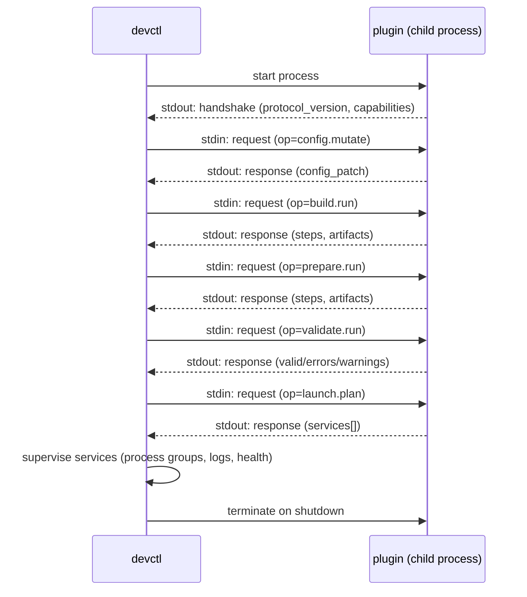
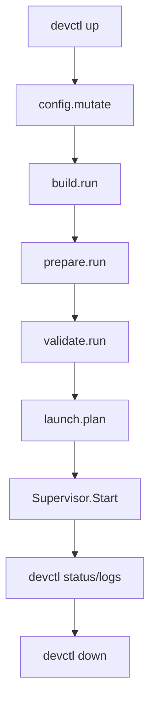
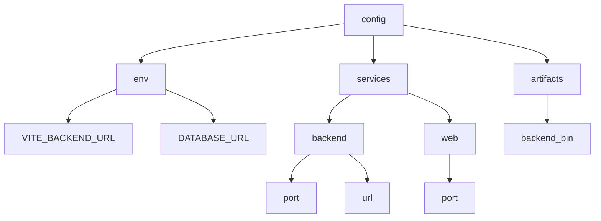

# devctl Plugin Authoring Guide (NDJSON Stdio Protocol v2)

devctl plugins let you take all the “tribal knowledge” of starting a dev environment—ports, env vars, build steps, prerequisites, and how to launch services—and turn it into a small, versioned, testable program. A plugin is just an executable that speaks a tiny NDJSON protocol over stdin/stdout, so devctl can ask it to compute config, validate prerequisites, run build/prepare steps, and produce a launch plan that devctl supervises.

This guide is a playbook, not just a spec. It explains the protocol, shows the mental model devctl uses when it talks to plugins, and gives you copy/paste examples (plus the patterns you’ll want once people actually rely on your plugin every day).

## 0. Start here (if you're new to devctl)

This document goes deep on the plugin protocol and the patterns that matter once you have multiple plugins, strictness rules, and real users. If you’re new to devctl overall, it’s usually faster to start with the user guide and the scripting guide first, then come back here for the complete protocol and schema details.

```text
glaze help devctl-user-guide
glaze help devctl-scripting-guide
```

## 1. What a devctl plugin is

A devctl plugin is a long-lived child process managed by devctl. devctl starts the process, expects an immediate handshake on stdout, and then drives the dev environment by sending request frames on stdin and reading response/event frames on stdout. Put differently: devctl is the orchestrator, and your plugin is the repo-specific adapter.

At a high level:

- devctl owns orchestration: ordering, timeouts, strictness, process supervision, state, and log capture.
- your plugin owns repo-specific logic: config derivation, prerequisite checks, build/prepare steps, and the service plan.
- the protocol boundary is small on purpose: JSON in, JSON out (so you can write plugins in whatever language your repo already uses).

If you’re replacing a large `startdev.sh`, a good rule of thumb is: move “policy and knowledge” into the plugin, and keep “running processes and tracking state” in devctl.

## 2. Quick start: your first plugin in 10 minutes

The quickest path to a useful plugin is to implement `config.mutate` and `launch.plan` for one service, then add `validate.run` so failures are actionable. This section is intentionally “boring”: it gets you to a working `devctl up/status/logs/down` loop as fast as possible, and you can iterate from there.

### Step 1: Create a plugin file

Create `plugins/myrepo-plugin.py`:

```python
#!/usr/bin/env python3
import json
import sys

def emit(obj):
    sys.stdout.write(json.dumps(obj) + "\n")
    sys.stdout.flush()

emit({
    "type": "handshake",
    "protocol_version": "v2",
    "plugin_name": "myrepo",
    "capabilities": {"ops": ["config.mutate", "validate.run", "launch.plan"]},
})

for line in sys.stdin:
    line = line.strip()
    if not line:
        continue
    req = json.loads(line)
    rid = req.get("request_id", "")
    op = req.get("op", "")

    if op == "config.mutate":
        emit({
            "type": "response",
            "request_id": rid,
            "ok": True,
            "output": {"config_patch": {"set": {"services.app.port": 8080}, "unset": []}},
        })
    elif op == "validate.run":
        emit({
            "type": "response",
            "request_id": rid,
            "ok": True,
            "output": {"valid": True, "errors": [], "warnings": []},
        })
    elif op == "launch.plan":
        emit({
            "type": "response",
            "request_id": rid,
            "ok": True,
            "output": {"services": [{"name": "app", "command": ["bash", "-lc", "python3 -m http.server 8080"]}]},
        })
    else:
        emit({
            "type": "response",
            "request_id": rid,
            "ok": False,
            "error": {"code": "E_UNSUPPORTED", "message": f"unsupported op: {op}"},
        })
```

Make it executable:

```bash
chmod +x plugins/myrepo-plugin.py
```

### Step 2: Add a `.devctl.yaml`

At the repo root:

```yaml
plugins:
  - id: myrepo
    path: python3
    args:
      - ./plugins/myrepo-plugin.py
    priority: 10
```

### Step 3: Verify handshake and run the pipeline

```bash
devctl plugins list
devctl plan
devctl up
devctl status
devctl logs --service app --follow
devctl down
```

If `plugins list` works, your handshake is valid and your stdout is clean. If `up` works, your `launch.plan` is valid and the supervisor can run the service.

## 3. The non-negotiable rules

The protocol is strict so devctl can be reliable and debuggable. The goal is that when things go wrong, you can trust the boundary: if devctl says “protocol contamination”, it really means stdout got polluted—not “maybe something else”.

- stdout is protocol-only NDJSON:
  - one JSON object per line
  - no extra whitespace or banners
  - no progress messages
- stderr is for humans:
  - print logs, progress, and debug information to stderr
  - devctl captures stderr and prefixes it with the plugin id
- the first stdout frame must be a handshake.

If you print anything non-JSON to stdout, devctl treats it as protocol contamination and fails the plugin.

## 4. Lifecycle and pipeline (diagrams)

The plugin lifecycle is a simple handshake + request loop, but it sits inside devctl’s larger pipeline. The most helpful way to design plugins is to think in phases: “what config do we need?”, “what must we build?”, “what must we prepare?”, “is it safe to proceed?”, and “what services should devctl supervise?”



This flowchart is the mental model to preserve as you add capabilities. Most plugin changes should feel like “filling in a box” (implementing one op), not “inventing a new orchestration path”.



## 5. Protocol frames: handshake, request, response, event

devctl’s protocol types are defined in Go and mirrored by JSON frames. You don’t need a client library; you just need to produce valid JSON objects with the expected keys and keep stdout clean. When in doubt, copy the JSON shapes in this section exactly and evolve them slowly.

### 5.1. Handshake (stdout, first frame)

The handshake tells devctl who you are and which operations you support.

```json
{
  "type": "handshake",
  "protocol_version": "v2",
  "plugin_name": "example",
  "capabilities": {
    "ops": ["config.mutate", "validate.run", "build.run", "prepare.run", "launch.plan"],
    "streams": ["logs.follow"],
    "commands": [
      { "name": "db-reset", "help": "Reset local DB" }
    ]
  },
  "declares": {
    "side_effects": "process",
    "idempotent": false
  }
}
```

**Fields:**

- `type`: must be `"handshake"`.
- `protocol_version`: currently `"v2"`.
- `plugin_name`: human-readable name.
- `capabilities`:
  - `ops`: list of supported request operations (`request.op`).
  - `streams`: optional, for stream-producing ops (see events).
  - `commands`: optional, for dynamic CLI commands (devctl wires cobra commands directly from this list; no separate discovery request).
- `declares`: optional metadata (devctl currently treats this as informational; use it anyway for clarity).

### 5.2. Request (stdin)

devctl sends request frames on stdin. The important thing to internalize is that devctl may call you with partial input (for example, a subset of requested steps), and it may do so under a deadline. Always validate inputs and handle unknown fields gracefully.

```json
{
  "type": "request",
  "request_id": "plugin-1",
  "op": "config.mutate",
  "ctx": {
    "repo_root": "/abs/path/to/repo",
    "cwd": "",
    "deadline_ms": 30000,
    "dry_run": false
  },
  "input": {
    "config": {}
  }
}
```

**Fields:**

- `request_id`: unique per call; echo it back in the response.
- `op`: operation name, e.g. `config.mutate`.
- `ctx`:
  - `repo_root`: repo root chosen by the user (`--repo-root`).
  - `deadline_ms`: remaining time budget for this operation (best-effort).
  - `dry_run`: whether devctl intends side effects to be skipped.
- `input`: op-specific JSON object; treat it as untrusted input and validate types.

### 5.3. Response (stdout)

For each request, emit exactly one response on stdout. If your plugin needs to do “background work” (like log following), do that via streams; don’t emit multiple responses for one request.

```json
{
  "type": "response",
  "request_id": "plugin-1",
  "ok": true,
  "output": {}
}
```

If you can’t handle the request, return `ok=false` with an error.

```json
{
  "type": "response",
  "request_id": "plugin-1",
  "ok": false,
  "error": { "code": "E_UNSUPPORTED", "message": "unsupported op" }
}
```

### 5.4. Event (stdout, streaming)

Some ops return a `stream_id` in their response output and then emit `event` frames. A good streaming op behaves like `tail -f`: it keeps sending log events until it can’t, then ends cleanly.

```json
{ "type": "event", "stream_id": "s1", "event": "log", "level": "info", "message": "hello" }
{ "type": "event", "stream_id": "s1", "event": "end", "ok": true }
```

Streams are for “follow” style operations where devctl should keep reading until you emit `event=end` (or devctl terminates the plugin).

## 6. Implementing common operations

Most real plugins implement some subset of the pipeline ops. devctl will call you only for the ops you declare, and it can merge outputs across multiple plugins in priority order (optionally enforcing strictness rules on collisions). That means you can start small—one plugin, one repo—and still have a path to shared “org-wide defaults” later.

### 6.1. `config.mutate`: return a config patch

`config.mutate` lets the plugin turn repo knowledge into config values. You return a `config_patch` with `set` and `unset`. Keys use dotted paths so you can build nested config incrementally.

```json
{
  "type": "response",
  "request_id": "x",
  "ok": true,
  "output": {
    "config_patch": {
      "set": {
        "env.VITE_BACKEND_URL": "http://localhost:8082",
        "services.backend.port": 8083
      },
      "unset": ["env.SOME_OLD_KEY"]
    }
  }
}
```

**Best practices:**

- treat `input.config` as the current config and compute a patch from it.
- keep names stable; changing a key is a breaking change for any scripts that read it.
- avoid “random” values (like ephemeral ports) unless you also patch the chosen value into config.
- make the patch idempotent: repeated application should converge.

### 6.2. `validate.run`: report pass/fail with actionable errors

Validation should answer: “can we proceed?” and “if not, what should the developer do next?”

```json
{
  "type": "response",
  "request_id": "x",
  "ok": true,
  "output": {
    "valid": false,
    "errors": [
      { "code": "E_MISSING_TOOL", "message": "missing tools: pnpm, docker" }
    ],
    "warnings": []
  }
}
```

**Best practices:**

- keep errors stable and searchable (consistent codes/messages).
- prefer errors that tell someone exactly what to install or configure.
- if something is required for *some* workflows but not others, return it as a warning and document it.

### 6.3. `build.run` / `prepare.run`: steps and artifacts

These ops are for deterministic side-effect steps (compilation, generating files, installing deps). The key design is that these steps are named and selectable, so a developer can rerun just the part they care about (or so CI can run a minimal subset).

```json
{
  "type": "response",
  "request_id": "x",
  "ok": true,
  "output": {
    "steps": [
      { "name": "backend", "ok": true, "duration_ms": 1234 }
    ],
    "artifacts": {
      "backend-bin": "backend/dist/server"
    }
  }
}
```

**Dry-run behavior:**

- if `ctx.dry_run` is true, do not perform side effects.
- still report which commands you would have run (to stderr) and return `ok=true` if the plan is valid.

### 6.4. `launch.plan`: describe services devctl should supervise

The launch plan is what devctl turns into processes, logs, health checks, and `devctl status/logs/down`. In practice, this is where plugins earn their keep: once the plan is correct, devctl can manage the whole environment consistently.

```json
{
  "type": "response",
  "request_id": "x",
  "ok": true,
  "output": {
    "services": [
      {
        "name": "backend",
        "cwd": "backend",
        "command": ["make", "run"],
        "env": { "PORT": "8083" },
        "health": { "type": "http", "url": "http://127.0.0.1:8083/health", "timeout_ms": 30000 }
      }
    ]
  }
}
```

**Service fields:**

- `name`: required; used as the stable identifier for logs/status.
- `cwd`: optional; resolved relative to `repo_root` if not absolute.
- `command`: required; argv array (no shell parsing unless you explicitly run a shell).
- `env`: optional; merged with the parent environment.
- `health`: optional; `type` is `"tcp"` or `"http"`; use `timeout_ms` for readiness.

### 6.5. `command.run`: plugin-defined CLI commands

Plugins can expose custom commands (e.g., `devctl db-reset`) without adding Go code to devctl. devctl reads command specs from the handshake and wires cobra subcommands dynamically. This is best used for small “dev chores” that are repo-specific but need to be discoverable and consistent across the team.

In protocol v2, command specs are advertised in the handshake:

```json
{
  "type": "handshake",
  "protocol_version": "v2",
  "plugin_name": "example",
  "capabilities": {
    "ops": ["command.run"],
    "commands": [
      { "name": "db-reset", "help": "Reset local DB" }
    ]
  }
}
```

devctl invokes the command via `command.run`:

```json
{
  "type": "request",
  "request_id": "x",
  "op": "command.run",
  "ctx": { "repo_root": "/abs/repo", "deadline_ms": 30000, "dry_run": false },
  "input": { "name": "db-reset", "argv": ["--force"], "config": { "services": {} } }
}
```

Your response should include an exit code:

```json
{ "type": "response", "request_id": "x", "ok": true, "output": { "exit_code": 0 } }
```

## 7. Merge behavior, ordering, and strictness

If you configure multiple plugins, devctl calls them in deterministic order and merges their outputs. This is how you can build a “stack” of plugins (shared org defaults + repo specifics) without forcing every repo to copy/paste the same logic.

- Ordering:
  - primary key: `priority` (lower first)
  - tie-break: plugin `id` (stable)
- Config merge:
  - each `config_patch` is applied in order
  - invalid dotted paths and type mismatches are treated as errors
- Step merge (`build.run`, `prepare.run`):
  - steps are merged by `name`
  - collisions are either errors (strict) or “last wins” (non-strict)
- Service merge (`launch.plan`):
  - services are merged by `name`
  - collisions are either errors (strict) or “last wins” (non-strict)

This is why stable names matter:

- good: `myrepo.backend`, `myrepo.web`, `db.reset`
- risky: `backend`, `web` (fine in a single-plugin repo, collision-prone in stacks)

## 8. A minimal Python plugin you can copy/paste

This skeleton is a good starting point for repo-local plugins. It is intentionally small and strict about stdout.

```python
#!/usr/bin/env python3
import json
import sys
import time

def emit(obj):
    sys.stdout.write(json.dumps(obj) + "\n")
    sys.stdout.flush()

def log(msg):
    sys.stderr.write(msg + "\n")
    sys.stderr.flush()

emit({
    "type": "handshake",
    "protocol_version": "v2",
    "plugin_name": "example",
    "capabilities": {"ops": ["config.mutate", "validate.run", "launch.plan"]},
})

for line in sys.stdin:
    line = line.strip()
    if not line:
        continue
    req = json.loads(line)
    rid = req.get("request_id", "")
    op = req.get("op", "")
    ctx = req.get("ctx", {}) or {}
    inp = req.get("input", {}) or {}

    dry_run = bool(ctx.get("dry_run", False))
    repo_root = ctx.get("repo_root", "")

    if op == "config.mutate":
        emit({"type": "response", "request_id": rid, "ok": True,
              "output": {"config_patch": {"set": {"env.EXAMPLE": "1"}, "unset": []}}})
    elif op == "validate.run":
        emit({"type": "response", "request_id": rid, "ok": True,
              "output": {"valid": True, "errors": [], "warnings": []}})
    elif op == "launch.plan":
        emit({"type": "response", "request_id": rid, "ok": True,
              "output": {"services": [{"name": "sleep", "command": ["bash","-lc","sleep 10"]}]}})
    else:
        emit({"type": "response", "request_id": rid, "ok": False,
              "error": {"code": "E_UNSUPPORTED", "message": f"unsupported op: {op}"}})
```

## 9. A minimal Bash plugin skeleton (with `jq`)

Bash is a perfectly reasonable choice for a plugin when your repo already uses shell scripts heavily. The main pitfall is JSON handling: if you build JSON by hand with string concatenation, you will eventually ship broken escaping and accidentally contaminate stdout. The safest approach is to use `jq` to both parse requests and construct responses.

This skeleton keeps stdout protocol-clean and sends all human output to stderr.

```bash
#!/usr/bin/env bash
set -Eeuo pipefail

log() { echo "[myrepo-plugin] $*" >&2; }

emit() {
  # Always emit exactly one JSON object (NDJSON) to stdout.
  jq -cn "$1"
}

emit_handshake() {
  emit '{
    type: "handshake",
    protocol_version: "v2",
    plugin_name: "myrepo",
    capabilities: { ops: ["config.mutate", "validate.run", "launch.plan"] }
  }'
}

emit_handshake

while IFS= read -r line; do
  [[ -z "${line}" ]] && continue

  # Parse common fields safely.
  request_id="$(jq -r '.request_id // ""' <<<"$line")"
  op="$(jq -r '.op // ""' <<<"$line")"
  dry_run="$(jq -r '.ctx.dry_run // false' <<<"$line")"
  repo_root="$(jq -r '.ctx.repo_root // ""' <<<"$line")"

  if [[ -z "${request_id}" || -z "${op}" ]]; then
    emit --arg rid "${request_id}" '{
      type: "response",
      request_id: $rid,
      ok: false,
      error: { code: "E_PROTOCOL_INVALID", message: "missing request_id or op" }
    }'
    continue
  fi

  case "${op}" in
    config.mutate)
      emit --arg rid "${request_id}" '{
        type: "response",
        request_id: $rid,
        ok: true,
        output: {
          config_patch: {
            set: { "services.app.port": 8080 },
            unset: []
          }
        }
      }'
      ;;

    validate.run)
      if ! command -v jq >/dev/null 2>&1; then
        emit --arg rid "${request_id}" '{
          type: "response",
          request_id: $rid,
          ok: true,
          output: {
            valid: false,
            errors: [{ code: "E_MISSING_TOOL", message: "missing tools: jq" }],
            warnings: []
          }
        }'
        continue
      fi

      emit --arg rid "${request_id}" '{
        type: "response",
        request_id: $rid,
        ok: true,
        output: { valid: true, errors: [], warnings: [] }
      }'
      ;;

    launch.plan)
      # If you *need* to run shell pipelines, keep them inside the service command,
      # not inside the plugin protocol loop.
      log "launch.plan (repo_root=${repo_root:-} dry_run=${dry_run:-false})"
      emit --arg rid "${request_id}" '{
        type: "response",
        request_id: $rid,
        ok: true,
        output: {
          services: [{
            name: "app",
            command: ["bash", "-lc", "python3 -m http.server 8080"],
            health: { type: "tcp", address: "127.0.0.1:8080", timeout_ms: 30000 }
          }]
        }
      }'
      ;;

    *)
      emit --arg rid "${request_id}" --arg op "${op}" '{
        type: "response",
        request_id: $rid,
        ok: false,
        error: { code: "E_UNSUPPORTED", message: ("unsupported op: " + $op) }
      }'
      ;;
  esac
done
```

**Bash plugin tips:**

- Treat `jq` as required; if your repo can’t depend on it, write the plugin in Python or Go instead.
- Never `echo` JSON by hand; use `jq -cn` so escaping is correct.
- Never write anything to stdout except protocol frames; use `>&2` for all logs.
- Prefer to keep heavy process work in devctl supervision (via `launch.plan`) rather than inside the plugin loop.

## 10. Wiring your plugin into a repo (`.devctl.yaml`)

devctl discovers plugins from a config file at the repo root (by default `.devctl.yaml`). This keeps plugin configuration close to the repo, which is usually what you want for dev environments.

```yaml
plugins:
  - id: myrepo
    path: python3
    args:
      - ./plugins/myrepo-plugin.py
    env:
      MYREPO_FEATURE_FLAG: "1"
    priority: 10
```

Then run:

```bash
devctl plugins list
devctl plan
devctl up
devctl status
devctl logs --service <name> --follow
devctl down
```

## 11. Designing stable config schemas (keys and conventions)

Plugins don’t just start processes; they define the “shape” of the dev environment through config keys. If you treat config keys as an API, teams can safely build on them: scripts can read them, other plugins can extend them, and developers can learn them once and reuse that knowledge across repos.

The goal is stability and predictability. A key name should answer: “what is this?” without requiring the reader to reverse-engineer the plugin.

### 11.1. Recommended key layout

The most common patterns are:

- `env.<NAME>`: environment variables you want to pass to services (or to the frontend dev server).
- `services.<service>.port`: a service’s configured port (even if the service command doesn’t use it directly, humans will).
- `services.<service>.url`: a service’s public URL (useful for other services and for validations).
- `artifacts.<name>`: stable paths to build outputs (only if you want other tools to consume them).

Here is a representative “config tree” for a typical repo:



### 11.2. Naming guidelines that keep you out of trouble

- Prefer “nouns” over “verbs” for keys:
  - good: `services.backend.url`
  - less good: `services.backend.start-command` (that belongs in `launch.plan`)
- Keep service names stable:
  - your service `name` in `launch.plan` is the identity for `devctl logs --service <name>`
  - don’t rename it casually
- Don’t overload `env.*`:
  - use `env.*` for values you actually intend to export to processes
  - keep internal plugin-only values under `services.*` or `artifacts.*`
- Treat keys as an API:
  - changing a key is a breaking change
  - adding a new key is usually safe
  - removing a key should be done with a deprecation window and a clear migration note

### 11.3. Versioning and deprecation (a practical approach)

You don’t need a formal semver scheme inside config, but you do need a plan for change.

- When introducing a replacement key:
  - continue writing the old key for a short period (if you must), and document the planned removal
  - emit a warning from `validate.run` telling developers what changed
- When removing a key:
  - do it as a deliberate change with a clear changelog entry
  - ensure any dependent scripts are updated in the same PR

If you have multiple plugins stacking on each other, favor compatibility at the edges (stable keys) rather than compatibility inside service commands.

## 12. Timeouts, cancellation, and dry-run

Plugins operate in messy environments: someone’s machine is slow, a subprocess hangs, Docker isn’t running, or a developer just wants to see what would happen without actually changing anything. devctl provides `ctx.deadline_ms` and `ctx.dry_run`, but your plugin still needs to enforce timeouts and safe behavior explicitly.

- `ctx.deadline_ms` is a hint:
  - wrap external commands with your own timeouts
  - for shell invocations, `timeout <dur> <cmd>` is often good enough
- devctl may terminate your process group:
  - treat SIGTERM as expected
  - keep state idempotent so reruns are safe
- `ctx.dry_run` should mean “no side effects”:
  - skip `docker compose up`, `pnpm install`, DB resets, etc.
  - it is fine to compute plans and print intended actions to stderr

## 13. Debugging and test strategy

Good plugins are boring: they behave deterministically and fail loudly with actionable messages.

- Make failures obvious:
  - write a single-line stderr log before running each external command
  - on error, include the command and exit code in stderr
- Reproduce quickly:
  - keep a small “fixture plugin” that simulates failures (timeouts, bad health, validation fail)
  - keep smoke tests that run a full `up/status/logs/down` loop in a temp repo

In this repo, the fixture patterns live under `devctl/testdata/plugins/` and smoke tests are runnable via `go run ./cmd/devctl smoketest-*`.

## 14. Troubleshooting: the common failure modes

Most plugin failures are protocol failures. This section is a checklist for the issues that tend to bite in real use.

- Protocol contamination:
  - symptom: devctl fails with a protocol/stdout error
  - cause: your plugin printed non-JSON to stdout
  - fix: move prints to stderr; ensure stdout emits only `json.dumps(obj)` + newline
- Missing handshake:
  - symptom: start fails with handshake timeout
  - cause: the first stdout frame was not a valid handshake
  - fix: emit handshake immediately and flush
- Op timeout:
  - symptom: `context deadline exceeded`
  - cause: plugin got stuck (hung process, waiting on network, deadlock)
  - fix: add per-command timeouts and log the exact command you ran
- Health timeout:
  - symptom: `tcp health timeout` or `http health timeout`
  - cause: service never bound, bound the wrong address, or HTTP never returns 2xx–4xx
  - fix: validate ports/URLs when producing `launch.plan` and log the readiness target

## 15. Reference: schema cheatsheet

This section summarizes what devctl expects at the JSON boundary. Use it when you’re implementing a plugin in a new language and just need the “shape of things”.

- `handshake.capabilities.ops`: list of operations you implement
- `request`:
  - `request.op`: one of your supported ops
  - `request.ctx.dry_run`: skip side effects when true
  - `request.ctx.deadline_ms`: time budget hint; enforce your own timeouts
- `response`:
  - `ok=true`: parse `output` according to the op
  - `ok=false`: provide `error.code` and `error.message`
- `event`:
  - emit for stream operations until you send `event=end`
