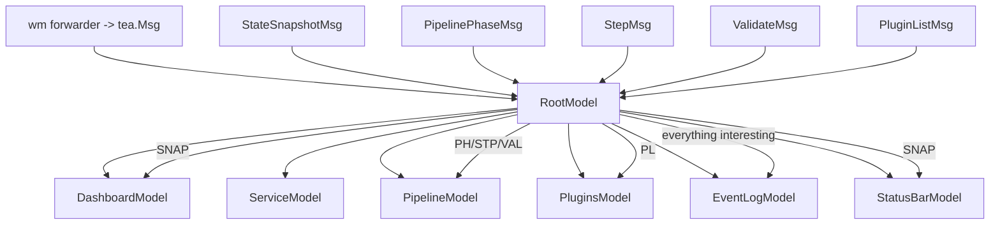

# Devctl TUI: Code Mapping and Integration Analysis

## Summary

This document maps the proposed `devctl tui` UX to the existing `devctl/pkg/*` and `devctl/cmd/devctl/cmds/*` code and proposes an event-driven architecture that couples `devctl` runtime/pipeline activity to a Bubble Tea TUI via Watermill. The architecture is derived from two existing patterns in this workspace:
- `bobatea`: a Watermill in-memory bus + router, with “transform” handlers and a forwarder that injects decoded UI messages into a `tea.Program`.
- `pinocchio`: a Watermill handler bound to a `tea.Program` that parses event payloads and calls `p.Send(...)` (or forwards via a channel consumed by Bubble Tea commands).

Key constraint: an MVP read-only dashboard+logs UI can be built purely from `.devctl/state.json` + log files, but the event bus becomes essential once we want live pipeline progress, validation UX, and plugin stream events to drive UI updates.

## Notes

## Inventory: existing primitives we can reuse

### Persisted runtime state + logs
- `devctl/pkg/state`:
  - `Load(repoRoot)` reads `.devctl/state.json`
  - `State.Services[]` holds `{Name, PID, Command, Cwd, Env, StdoutLog, StderrLog}`
  - `ProcessAlive(pid)` checks liveness via `syscall.Kill(pid, 0)`
  - `LogsDir(repoRoot)` is `.devctl/logs/` (supervisor writes logs there)
- `devctl/cmd/devctl/cmds/logs.go`:
  - Implements `followFile(ctx, path, w)` (seek to end and poll every 200ms)

### Pipeline (config/build/prepare/validate/plan)
- `devctl/pkg/engine.Pipeline`:
  - `MutateConfig(ctx, patch.Config)` → merged config
  - `Build(ctx, cfg, steps)` → `BuildResult{Steps, Artifacts}`
  - `Prepare(ctx, cfg, steps)` → `PrepareResult{Steps, Artifacts}`
  - `Validate(ctx, cfg)` → `ValidateResult{Valid, Errors, Warnings}`
  - `LaunchPlan(ctx, cfg)` → `LaunchPlan{Services[]ServiceSpec}`
- CLI reference for sequencing: `devctl/cmd/devctl/cmds/up.go`

### Supervision (process start/stop)
- `devctl/pkg/supervise.Supervisor`:
  - `Start(ctx, plan)` spawns each service and writes logs
  - `Stop(ctx, state)` terminates each service process group and returns last error
- CLI reference: `devctl/cmd/devctl/cmds/up.go` and `devctl/cmd/devctl/cmds/down.go`

### Plugins discovery & runtime protocol
- `devctl/pkg/config`:
  - `.devctl.yaml` parsed into configured plugins
- `devctl/pkg/discovery`:
  - `Discover(cfg, Options{RepoRoot})` returns `[]runtime.PluginSpec` including auto-scan of `plugins/devctl-*`
- `devctl/pkg/runtime.Factory`:
  - `Start(ctx, spec)` spawns plugin process, reads handshake, returns `runtime.Client`
  - `Client.Handshake()` returns ops/streams/commands capabilities
  - `Client.StartStream(...)` exists, but the CLI does not use it yet
- CLI reference for plugin inspection: `devctl/cmd/devctl/cmds/plugins.go`

## Mapping: UX features → code touch points

### Dashboard: system status, uptime, services table
- **System status**:
  - If `state.Load(repoRoot)` succeeds: status “Running”.
  - If state file is missing: status “Stopped”.
  - If state exists but no PIDs alive: status “Degraded” (or “Stopped (stale state)”) and highlight.
- **Uptime**:
  - Use `State.CreatedAt` to render elapsed time.
- **Services table rows**:
  - From `State.Services[]` plus `state.ProcessAlive(pid)`.
  - Command display: `strings.Join(ServiceRecord.Command, " ")` (safe truncation for UI).
  - Cwd: already stored as absolute path by supervisor.
- **What we *cannot* show yet** (needs future work):
  - CPU/MEM: no process sampling in repo.
  - Health endpoint/status: `engine.ServiceSpec.Health` exists during `up`, but not persisted into `state.State`.

### Service detail: stdout/stderr viewer (follow + scrollback)
- We can reuse the same tail logic as `cmds/logs.go`:
  - For follow mode: open file, seek to end, read lines, poll on EOF.
  - For initial viewport: either “tail N lines” (new code) or “start empty and follow”.
- UX note: the TUI should display the log file path (from state) prominently to help debugging.

### Plugins pane: list plugins + capabilities
- Implementation is essentially `plugins list`:
  - `config.LoadOptional(opts.Config)`
  - `discovery.Discover(cfg, discovery.Options{RepoRoot: opts.RepoRoot})`
  - For each spec:
    - `factory.Start(...)`
    - record `Handshake().Capabilities`
    - `Close(...)`
- UX note: this view can be slower; consider caching and exposing a manual refresh key.

### Pipeline / validation view (for runs initiated inside the TUI)
- The TUI can replicate the existing sequencing in `cmds/up.go`, but instead of printing JSON/errors, it can:
  - record phase start/end times (TUI-side),
  - store `BuildResult`, `PrepareResult`, `ValidateResult`, and `LaunchPlan` in an in-memory “last run” model,
  - render validation errors/warnings in a table view keyed by `protocol.Error{Code,Message,Details}`.

### Actions: up/down/restart
We have two viable approaches:

**Option A (preferred): call existing packages directly**
- Essentially “extract” `cmds/up.go` and `cmds/down.go` logic into shared helpers:
  - Start/stop are already orchestrated using public `pkg/*` APIs.
  - Avoid shelling out and parsing stdout.

**Option B: shell out to `devctl up/down`**
- Avoids refactor risk but is worse UX:
  - Harder to surface structured pipeline results.
  - Requires capturing and interpreting stdout/stderr.

The design doc assumes Option A.

### “Recent events” pane
- Today, there is no persisted event stream or supervisor event bus.
- MVP approach:
  - The TUI emits events when it observes something:
    - pipeline phase transitions (start/end)
    - validation errors detected
    - state refresh shows a PID transitioned alive→dead
  - Optional: include the last N structured log lines as “events” if we can identify patterns (but avoid heuristics in v0).
- Future approach:
  - Extend plugins/engine to emit `protocol.Event` frames during pipeline execution, and wire them into the UI.

## Watermill → Bubble Tea coupling (pattern to reuse)

Once `devctl tui` needs to feel “alive” (pipeline progress ticks forward, services flip from starting→ready, validation errors land with context), the UI needs a reliable way to ingest events from multiple background activities without turning the Bubble Tea update loop into a ball of mutexes.

The happy path here is already demonstrated in this repo: both `bobatea` and `pinocchio` treat Watermill as the concurrency boundary and Bubble Tea as the single-threaded renderer. The details differ, but the idea is the same: *background goroutines publish events*, *a router/handler layer translates them*, and *the Bubble Tea program only ever sees typed `tea.Msg` values*.

### Pattern A (bobatea): bus + router + transformer + program forwarder
This is the “clean separation” approach. It’s especially good when you have multiple producers and multiple consumers.

Core pieces (in plain terms):
- Create an in-memory Watermill pubsub + `message.Router` and run it in a goroutine.
- Publish “domain events” to a topic.
- Add a handler that **transforms** domain events into UI-shaped envelopes on a separate topic.
- Add a handler that **forwards** decoded UI messages into Bubble Tea via `p.Send(...)`.

Relevant reference points (worth reading in-order):
- Bus: `bobatea/pkg/eventbus/eventbus.go` (`NewInMemoryBus`, `AddHandler`, `Run`)
- Transformer: `bobatea/pkg/repl/wm_transformer.go` (subscribe to `repl.events`, publish `ui.entities`)
- UI forwarder: `bobatea/pkg/timeline/wm_forwarder.go` (decode envelope, `p.Send(...)`)

Why this works well for `devctl tui` (the “so what”):
- Keeps `tea.Model.Update` pure and single-threaded (only `tea.Msg` enters).
- Lets multiple producers publish to a single “bus” (state watcher, pipeline runner, plugin stream reader).
- Enables composability: you can add handlers later (e.g., write the same event stream to a debug log, or drive a status bar and a timeline simultaneously) without rewriting the UI.

### Pattern B (pinocchio): bind a Watermill handler to a `tea.Program`
This is the “direct injection” approach. It’s simpler to bootstrap, and it’s great when you have one main event stream and a single target program.

Core pieces:
- Build a Watermill handler closure that closes over a `*tea.Program`.
- Parse `msg.Payload` into a typed event.
- Switch on event type and `p.Send(...)` the corresponding `tea.Msg` (often a richer internal message type).

Relevant reference points:
- `pinocchio/pkg/ui/backend.go`: `StepChatForwardFunc(p *tea.Program) func(*message.Message) error`
- `pinocchio/pkg/ui/runtime/builder.go`: binds handler once a `tea.Program` exists (`BindHandlerWithProgram`)

When to use in `devctl tui`:
- When we don’t need a multi-topic transformation graph and can map “event → UI msg” directly.

### Recommended for devctl: Pattern A (bus/transform/forward), with a tiny helper for Pattern B
The `devctl tui` problem has multiple sources (state poller, pipeline runner, plugin discovery, optional plugin streams) and multiple UI consumers (dashboard, pipeline view, event list, status bar). Pattern A keeps this sane by introducing one explicit “routing layer” between `devctl/pkg/*` and the Bubble Tea models.

The mental model:
- Domain event producers (pipeline/supervisor/state watcher/plugin stream) publish to a single topic.
- A transformation layer fans out to multiple UI message streams as needed.
- A single “program forwarder” injects into Bubble Tea safely.

## How `devctl/pkg/*` will emit Watermill events

### Goals
Think of this as building a small “event journal” for a devctl run:
- Pipeline phases start/finish, with durations.
- Each service transitions through starting/started/ready.
- Validation errors/warnings show up as structured data, not just a blob of JSON.

We want those facts to be:
- easy to publish from background work,
- easy to subscribe to from multiple UI components,
- and easy to translate into Bubble Tea messages.

Boundary rule (important): `devctl/pkg/*` produces **domain events**, and the TUI layer turns them into **UI messages** (`tea.Msg`).

### Proposed bus surface area (API)
Pseudocode API:

```go
// package tui/events (or pkg/tui/events)

// Event is the common envelope; Payload is one of the concrete event structs below.
type Event struct {
    ID        string            // uuid
    Time      time.Time
    Kind      string            // "pipeline.phase.started", "service.started", ...
    RepoRoot  string
    Fields    map[string]string // plugin_id, service_name, phase, op, stream_id, ...
    Payload   json.RawMessage   // marshaled concrete payload (optional)
}

type Publisher interface {
    Publish(topic string, e Event) error
}

type Bus struct {
    Router *message.Router
    Pub    message.Publisher
    Sub    message.Subscriber
}
```

Topic naming (suggested):
- `devctl.events` (domain events)
- `devctl.ui.msgs` (UI envelopes destined for Bubble Tea)
- `devctl.ui.actions` (optional: UI→backend actions if we want handlers rather than direct function calls)

### Concrete devctl event payloads (data structure signatures)
These are the *domain* events (not Bubble Tea messages):

```go
// pipeline lifecycle
type PipelineRunStarted struct { RunID string; Strict bool; DryRun bool }
type PipelinePhaseStarted struct { RunID string; Phase string /* mutate|build|prepare|validate|plan|supervise */ }
type PipelinePhaseFinished struct { RunID string; Phase string; Ok bool; Duration time.Duration; Err string }

// plugin operations (sync calls)
type PluginCallStarted struct { RunID string; PluginID string; Op string }
type PluginCallFinished struct { RunID string; PluginID string; Op string; Ok bool; Duration time.Duration; Err string }

// plugin streams (optional future)
type PluginStreamStarted struct { RunID string; PluginID string; Stream string /* stream name or op */; StreamID string }
type PluginStreamEvent struct { RunID string; PluginID string; StreamID string; Event string; Level string; Message string; Fields map[string]any }
type PluginStreamEnded struct { RunID string; PluginID string; StreamID string; Ok *bool }

// build/prepare steps
type StepStarted struct { RunID string; Phase string /* build|prepare */; Name string }
type StepFinished struct { RunID string; Phase string; Name string; Ok bool; Duration time.Duration }

// validation
type ValidateFinished struct {
    RunID string
    Valid bool
    Errors []protocol.Error
    Warnings []protocol.Error
}

// supervision/services
type ServiceStarting struct { RunID string; Name string; Cwd string; Command []string }
type ServiceStarted struct { RunID string; Name string; PID int; StdoutPath string; StderrPath string }
type ServiceReady struct { RunID string; Name string; HealthType string; AddressOrURL string }
type ServiceExitObserved struct { Name string; PID int; When time.Time; Reason string }

// state polling / snapshots (UI refresh)
type StateSnapshot struct { RepoRoot string; At time.Time; State *state.State; Alive map[string]bool /* by service name */ }
```

Where these events originate in current code (mapping):
- `engine.Pipeline.*`:
  - publish `PluginCallStarted/Finished` around each `Client.Call(...)`
  - publish `PipelinePhaseStarted/Finished` around each phase method
  - publish `ValidateFinished` from `Pipeline.Validate`
  - publish `StepFinished` for each `StepResult` returned (build/prepare)
- `supervise.Supervisor.Start`:
  - publish `ServiceStarting/ServiceStarted` per service
  - publish `ServiceReady` when `waitReady` succeeds
- TUI state watcher (new, in tui layer):
  - on each refresh tick: read state + compute liveness; publish `StateSnapshot`
  - if a previously-alive PID becomes dead: publish `ServiceExitObserved`
- Plugin stream adapter (future; based on `runtime.Client.StartStream`):
  - on stream start/each `protocol.Event`/end: publish `PluginStream*` events

### How to implement publishing without “infecting” `pkg/*` everywhere
Two incremental approaches (both workable):

**Approach 1: add an optional event publisher to `engine.Pipeline` and `supervise.Supervisor`**
- Extend structs with `Events Publisher` (or `Events func(Event)`) defaulting to nil.
- In code, guard with `if p.Events != nil { ... }`.

**Approach 2 (preferred): wrap existing types in a TUI orchestration layer**
- Keep `devctl/pkg/engine` and `devctl/pkg/supervise` stable initially.
- Add `pkg/tui/backend` wrappers that:
  - call the real pipeline/supervisor,
  - compute durations and results,
  - publish events to the bus.

Approach 2 keeps the core packages UI-agnostic and reduces the surface area of code changes required for MVP.

## Injecting Watermill events into Bubble Tea

### The invariant
Bubble Tea state must be mutated only in `Update(msg tea.Msg)`. Everything else must eventually produce `tea.Msg` delivered to the program.

Practically, this means we should treat Watermill handlers as “message translators”, not as places where we mutate UI state. Their job is to decode/shape data and then hand it to Bubble Tea, which stays in control of rendering and state transitions.

### Recommended injection mechanism: program forwarder handler (`p.Send`)
This mirrors `bobatea/pkg/timeline/wm_forwarder.go` and `pinocchio/pkg/ui/backend.go`.

This is also the simplest thing to reason about: the only cross-thread entrypoint into Bubble Tea becomes `p.Send(...)`, and everything else stays ordinary Go code.

Pseudocode:

```go
// package tui/wm (or pkg/tui/wm)
type UIEnvelope struct {
    Type string          `json:"type"`    // e.g., "tui.state.snapshot", "tui.pipeline.phase"
    Payload json.RawMessage `json:"payload"`
}

func RegisterProgramForwarder(bus *eventbus.Bus, p *tea.Program) {
    bus.AddHandler("ui-forward", "devctl.ui.msgs", func(msg *message.Message) error {
        defer msg.Ack()
        var env UIEnvelope
        if err := json.Unmarshal(msg.Payload, &env); err != nil { return err }
        switch env.Type {
        case "tui.state.snapshot":
            var m StateSnapshotMsg
            if json.Unmarshal(env.Payload, &m) == nil { p.Send(m) }
        case "tui.pipeline.phase":
            var m PipelinePhaseMsg
            if json.Unmarshal(env.Payload, &m) == nil { p.Send(m) }
        // ...
        }
        return nil
    })
}
```

### Alternative injection mechanism: channel + `tea.Cmd` pump
Useful if we want to keep `tea.Program` out of handlers, or if we need backpressure control.
This mirrors the channel-based approach described in `pinocchio/cmd/agents/simple-chat-agent/INTEGRATING-BUBBLETEA-LIPGLOSS.md`.

Pseudocode:

```go
type watermillUIEvent struct { Type string; Payload []byte }
type uiEventMsg struct { Event watermillUIEvent }

func waitForUIEvent(ch <-chan watermillUIEvent) tea.Cmd {
    return func() tea.Msg { return uiEventMsg{Event: <-ch} }
}
```

In this pattern, Watermill handlers write to a buffered channel, and models schedule `waitForUIEvent(...)` in `Init()` / after each event.

For `devctl tui`, `p.Send` is simpler and closer to the bobatea approach.

## Bubble Tea model composition (one model per file)

### Root model responsibilities
The root model is an orchestrator:
- owns navigation state (“which view is active”),
- owns shared state slices (selected service, filters, global errors),
- fans out incoming messages to the relevant submodels,
- aggregates their views into the final layout (header/statusbar + main pane + footer/help).

The goal isn’t “perfect separation” on day one; it’s to keep each view’s logic local. If a message should update multiple views (e.g., a state snapshot updates both the dashboard and the status bar), the root model can forward the message to both submodels, and each submodel can decide what it cares about.

Minimal pseudocode surface:

```go
// tea.Msg types are defined centrally (msgs.go) so multiple models can react.
type Msg interface{}

type RootModel struct {
    width, height int
    activeView ViewID // dashboard|service|pipeline|plugins|help
    keymap Keymap

    dashboard DashboardModel
    service   ServiceModel
    pipeline  PipelineModel
    plugins   PluginsModel
    events    EventLogModel
    help      HelpModel
    status    StatusBarModel
}

func (m RootModel) Init() tea.Cmd { return tea.Batch(/* child init cmds */) }
func (m RootModel) Update(msg tea.Msg) (tea.Model, tea.Cmd) {
    // global routing: window size, quit/help, view switching
    // domain routing: state snapshots, pipeline events, log lines, plugin updates
    // focused routing: keybindings delegated to active child model
}
```

### Proposed message types (UI-level; produced by Watermill→UI transformer)
These are *Bubble Tea messages* (the things submodels consume). They may embed the domain events.

```go
// msgs.go
type StateSnapshotMsg struct { Snapshot StateSnapshot }
type PipelinePhaseMsg struct { RunID string; Phase string; Status string /* started|finished */; Ok *bool; Err string }
type StepMsg struct { RunID string; Phase string; Name string; Ok *bool; Duration time.Duration }
type ValidateMsg struct { RunID string; Valid bool; Errors []protocol.Error; Warnings []protocol.Error }
type ServiceMsg struct { Name string; PID int; Alive *bool; StdoutPath string; StderrPath string }
type PluginListMsg struct { Plugins []PluginInfo }
type EventLogAppendMsg struct { Event Event } // generic “timeline” row
type UserActionMsg struct { Action string; Args map[string]string } // optional
```

### File layout sketch (one model per file)
Proposed package structure (illustrative):

```
devctl/pkg/tui/
  README.md                          # high-level architecture notes
  bus.go                             # Watermill bus creation + topics
  events.go                          # domain event structs + helpers
  wm_transform.go                    # devctl.events -> devctl.ui.msgs
  wm_forward.go                      # devctl.ui.msgs -> p.Send(tea.Msg)
  msgs.go                            # Bubble Tea message types
  keymap.go                          # key bindings, help strings
  backend_orchestrator.go            # runs up/down/plan; publishes domain events
  state_watcher.go                   # reads state.json; publishes StateSnapshot/ServiceExitObserved
  plugin_stream_adapter.go           # (future) runtime.Client streams -> domain events
  models/
    root_model.go
    dashboard_model.go
    service_model.go                 # service detail + logs tabs (or split further)
    pipeline_model.go
    plugins_model.go
    eventlog_model.go
    help_model.go
    statusbar_model.go
```

If “one model per file” must be strict, keep each `type XModel` in its own file under `models/` and keep shared msg types outside.

### Model responsibilities & subscriptions (routing table)
Which UI messages should affect which model(s):
- `StateSnapshotMsg` → `DashboardModel`, `StatusBarModel`, `EventLogModel` (optional)
- `ServiceMsg` → `DashboardModel`, `ServiceModel`, `EventLogModel`
- `PipelinePhaseMsg` → `PipelineModel`, `StatusBarModel`, `EventLogModel`
- `StepMsg` → `PipelineModel`, `EventLogModel`
- `ValidateMsg` → `PipelineModel`, `DashboardModel` (status banner), `EventLogModel`
- `PluginListMsg` → `PluginsModel`, `DashboardModel` (counts), `EventLogModel` (optional)
- `EventLogAppendMsg` → `EventLogModel` only

## Event routing diagram (end-to-end)

### High-level flow (plugins → pkg → Watermill → Bubble Tea)
```mermaid
flowchart LR
  subgraph Plugins
    P1[plugin process] -->|handshake/call/stream| RT[runtime.Client]
  end

  RT --> ENG[engine.Pipeline]
  ENG --> SUP[supervise.Supervisor]
  SUP --> ST[state.json + logs]

  subgraph TUI_Backend
    ORCH[orchestrator (RunUp/Down/Restart)] --> BUS[(Watermill bus)]
    WATCH[state watcher] --> BUS
    STREAM[plugin stream adapter] --> BUS
  end

  ENG -.calls/results.-> ORCH
  SUP -.service start/ready.-> ORCH
  ST -.poll/read.-> WATCH
  RT -.protocol.Event (future).-> STREAM

  BUS --> XFORM[transform: devctl.events -> devctl.ui.msgs]
  XFORM --> FWD[forward: devctl.ui.msgs -> tea.Program.Send]
  FWD --> BT[Bubble Tea Program]
  BT --> MODELS[Root + submodels]
```

### “Which component forwards what” (model-level fanout)


## Decisions (updated)
- Use a Watermill bus for all non-trivial live updates (pipeline progress, validation, plugin streams), modeled after `bobatea/pkg/eventbus`.
- Inject Bubble Tea messages via `tea.Program.Send` from a Watermill handler (as in both `bobatea` and `pinocchio`) rather than polling channels in the UI loop.
- Keep “domain events” separate from “UI messages”: transform events before injection so models only see UI-shaped `tea.Msg` types.
- Prefer an in-process implementation (reuse `devctl/pkg/*`) over shelling out to `devctl` subcommands.
- Keep the MVP strictly within the currently persisted state + logs; treat CPU/MEM and health status as follow-on enhancements.

## Next Steps (updated)
1) Decide where the bus lives: `devctl/pkg/tui` (preferred) vs `devctl/cmd/devctl` (less reusable).
2) Decide initial event vocabulary (minimal set for M0–M3) and lock topic names.
3) Add doc links/relations from this working note to the `bobatea` and `pinocchio` reference files used as examples.

## Seams we likely need (and where)

### Shared helpers vs. duplicating CLI logic
To keep the MVP clean, prefer creating small, testable helpers in `devctl/pkg/*` and keep `cmds/*` thin:
- `pkg/tui/backend` (or similar) can expose:
  - `LoadState(repoRoot)`, `RemoveState(repoRoot)`
  - `RunUp(ctx, opts)` returning a structured outcome (phase timings + results)
  - `RunDown(ctx, opts)`
  - `ListPlugins(ctx, opts)` returning specs + handshake caps
  - `TailLog(ctx, path)` / `FollowLog(ctx, path)`

This avoids importing `cmds` from the TUI code and prevents circular dependencies.

### State enrichment (health specs)
If we want health status in the dashboard (as in the mockups), we need one of:
1) Persist the launch plan (or a subset) into `state.State` (most direct).
2) Recompute plan on demand for the dashboard (more expensive; requires starting plugins).
3) Maintain a separate “tui cache” file for derived metadata (keeps state.json stable).

The design doc currently treats this as an optional milestone; the MVP can ship without it.

### CPU/MEM
No current abstraction exists. Options:
- Add a lightweight `/proc` sampler (Linux-only) in `pkg/`.
- Add a dependency like gopsutil (heavier; needs go.mod changes).
- Defer indefinitely and drop those columns from the UI.

## Risks / sharp edges
- **Plugin stdout contamination**: `runtime.Client` fails hard if plugin stdout isn’t valid JSON frames. The TUI must not attempt to parse plugin stdout beyond the existing runtime layer; use `Handshake()` and `Call()` only.
- **Cleanup & cancellation**: `cmds/up.go` carefully defers `Close()` on plugin clients; the TUI needs the same discipline (especially if the user cancels a pipeline run mid-flight).
- **State staleness**: state.json can exist with dead PIDs; the dashboard should detect and communicate that clearly, and offer a “clean state” action (down/remove).
