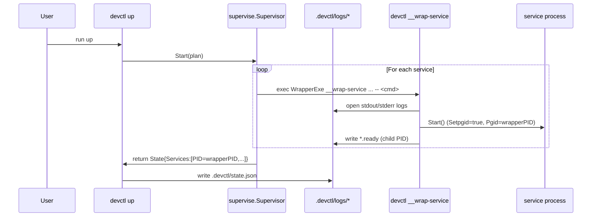
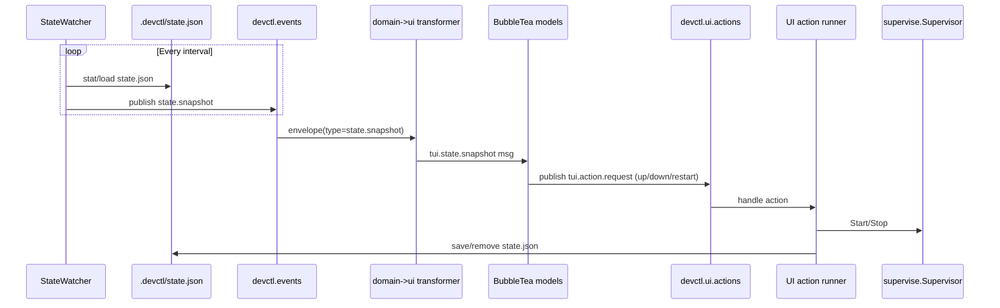

# Service supervision: architecture, events, and UI integration

## 1) Executive summary

`devctl` supervises long-running “services” (processes) by:
1) computing an `engine.LaunchPlan` (via plugins),
2) starting each service (directly or via an internal wrapper),
3) writing a persistent state file under `.devctl/`,
4) providing observation/control via CLI commands (`status`, `logs`, `down`) and via the TUI (polling + event bus + actions).

Key design properties:
- Supervision is **process-group oriented**: `terminatePIDGroup` tries to stop an entire process group via `kill(-pgid, SIGTERM/SIGKILL)` (`devctl/pkg/supervise/supervisor.go`).
- Wrapper mode (`devctl __wrap-service`) is a **single-binary supervision strategy**: the wrapper is a hidden Cobra subcommand in the same binary (`devctl/cmd/devctl/cmds/wrap_service.go`).
- The TUI does **not** subscribe to supervisor events; it observes supervision indirectly by polling `.devctl/state.json` and checking whether PIDs are alive (`devctl/pkg/tui/state_watcher.go`).

The most important “system invariant” to keep in mind:
- Anything that delays the wrapper binary before it reaches `__wrap-service` can break supervise startup, because the supervisor waits for a `*.ready` file within a short deadline (currently hard-coded to 2 seconds).

## 2) Goals and non-goals

### 2.1 Goals (what this layer promises)
- Start services described by a `LaunchPlan`, capture logs, and stop them reliably.
- Persist enough metadata on disk to support:
  - CLI inspection (`devctl status`, `devctl logs`)
  - a polling-based UI that can display “running vs dead”, health, CPU/memory, and log tails.
- Provide a “minimum viable” readiness mechanism:
  - a fast “wrapper started the child” marker (`*.ready`)
  - optional service health checks (TCP/HTTP).

### 2.2 Non-goals (what it does not currently promise)
- Automatic restart of crashed services (there is no respawn loop).
- Fine-grained per-service lifecycle commands in the CLI (stop/restart single service) as a first-class concept.
- Rich event semantics (structured “service started”, “service exited with code”, “health degraded”) emitted by the supervisor.

## 3) Terminology and the process model

### 3.1 Core terms
- **Service**: A long-running process described by `engine.ServiceSpec` and recorded in state as `state.ServiceRecord`.
- **Supervisor**: A Go component that starts services and stops them; in code: `devctl/pkg/supervise.Supervisor`.
- **Wrapper**: An internal helper process that starts the real service and writes exit metadata; in code: `devctl __wrap-service`.
- **Child**: The actual service process (e.g. `bin/http-echo`) started by the wrapper.
- **Process group**: A Unix concept that enables group termination; in code: `syscall.Kill(-pgid, sig)`.

### 3.2 PID map (critical for reasoning)

In wrapper mode, there are *two* relevant PIDs:

| Thing | Stored in `state.json`? | Where | Notes |
|------|--------------------------|-------|------|
| Wrapper PID | Yes | `state.ServiceRecord.PID` | Used as the stop handle: supervisor calls `terminatePIDGroup(PID)` |
| Child PID | No | `*.ready` file; `*.exit.json` | Not currently used by the supervisor or UI as a “handle” |

Implication:
- Any “kill by PID” feature in the UI must remember that `ServiceRecord.PID` may be the wrapper PID, not the actual child PID.

## 4) Filesystem artifacts and persistence

All supervision artifacts live under the repo root:

```
<repo-root>/
  .devctl/
    state.json
    logs/
      <service>-<ts>.stdout.log
      <service>-<ts>.stderr.log
      <service>-<ts>.ready          # wrapper mode only
      <service>-<ts>.exit.json      # wrapper mode only (structured ExitInfo)
```

### 4.1 State file schema (`.devctl/state.json`)
Defined in `devctl/pkg/state/state.go`:

```go
type State struct {
  RepoRoot  string
  CreatedAt time.Time
  Services  []ServiceRecord
}

type ServiceRecord struct {
  Name      string
  PID       int
  Command   []string
  Cwd       string
  Env       map[string]string
  StdoutLog string
  StderrLog string
  ExitInfo  string  // optional: path to *.exit.json
  StartedAt time.Time

  HealthType    string // optional
  HealthAddress string // optional
  HealthURL     string // optional
}
```

Notes:
- `PID` is “the supervised handle”, not necessarily “the child PID”.
- `Env` is sanitized (`state.SanitizeEnv`) before persisting (intended to avoid leaking secrets).

### 4.2 Exit info schema (`*.exit.json`)
Defined in `devctl/pkg/state/exit_info.go`:

```go
type ExitInfo struct {
  Service   string
  PID       int
  StartedAt time.Time
  ExitedAt  time.Time
  ExitCode  *int
  Signal    string
  Error     string
  StderrTail []string
  StdoutTail []string
}
```

Notes:
- Only `StderrTail` is populated by the wrapper today (`wrap_service.go` reads tail lines from the stderr log).
- The TUI uses `ReadExitInfo` for “dead service” presentation, but only if `ExitInfo` is present in the state record.

## 5) Startup and stop sequences (CLI + wrapper)

This section is written as “what happens, in order”.

### 5.1 CLI: `devctl up` (high-level)
Entry point: `devctl/cmd/devctl/cmds/up.go` (`newUpCmd`).

Sequence:
1) Load root options (`--repo-root`, `--config`, `--timeout`, etc).
2) If state exists:
   - if interactive: prompt to restart/remove state
   - else: refuse unless `--force`.
3) Discover and start plugins (handshake with timeouts).
4) Run pipeline phases:
   - `config.mutate`
   - `build.run` (optional)
   - `prepare.run` (optional)
   - `validate.run` (optional; abort on invalid)
   - `launch.plan`
5) Create supervisor with wrapper mode:
   - `wrapperExe, _ := os.Executable()`
   - `supervise.New(Options{RepoRoot, ReadyTimeout: opts.Timeout, WrapperExe: wrapperExe})`
6) `Supervisor.Start(ctx, plan)`
7) `state.Save(repoRoot, st)`

#### Diagram: wrapper-mode start sequence



### 5.2 Supervisor: `Start(ctx, plan)` (core loop)
Implementation: `devctl/pkg/supervise/supervisor.go`.

```text
Start(plan):
  mkdir .devctl/logs
  st := State{RepoRoot, CreatedAt, Services: []}
  for svc in plan.Services:
    rec := startService(svc)
    if err: Stop(already-started); return err
    st.Services += rec
  for svc in plan.Services:
    if svc.Health != nil:
      waitReady(timeout = Options.ReadyTimeout)
      if err: Stop(all); return err
  return st
```

Key observations:
- `Start` is “start everything, then health-check everything”, not “start+health-check per service”.
- On any failure, it attempts to stop whatever it has already started (`Stop(context.Background(), st)`).

### 5.3 `startService`: direct mode vs wrapper mode
Implementation: `devctl/pkg/supervise/supervisor.go` (`startService`).

**Direct mode** (`Options.WrapperExe == ""`):
- Supervisor starts the service process directly via `exec.CommandContext(ctx, svc.Command[0], ...)`.
- Stdout/stderr are redirected directly into per-service log files.
- `ServiceRecord.PID` is the *service process PID*.
- No `ExitInfo` is written.

**Wrapper mode** (`Options.WrapperExe != ""`):
- Supervisor starts `WrapperExe __wrap-service ... -- <real service command...>`.
- Stdout/stderr logs are paths passed *to the wrapper*; the supervisor itself does not attach to wrapper output.
- `ServiceRecord.PID` is the *wrapper PID*.
- `ServiceRecord.ExitInfo` is a path passed to the wrapper for structured metadata on exit.

Wrapper-mode pseudocode:

```text
args := ["__wrap-service",
         "--service", name,
         "--cwd", cwd,
         "--stdout-log", stdoutPath,
         "--stderr-log", stderrPath,
         "--exit-info", exitInfoPath,
         "--ready-file", readyPath,
         "--env", "K=V", ...,
         "--",
         <service command...>]

cmd := exec.Command(WrapperExe, args...)
cmd.Dir = RepoRoot
cmd.Env = os.Environ()
cmd.SysProcAttr = {Setpgid: true}
cmd.Start()

wait for readyPath to appear (deadline currently hard-coded to 2s)
record ServiceRecord{PID: wrapperPID, ExitInfo: exitInfoPath, ...}
```

### 5.4 Wrapper: `devctl __wrap-service` (what it does)
Implementation: `devctl/cmd/devctl/cmds/wrap_service.go`.

The wrapper:
1) Disables zerolog output completely (it writes nothing to its own stdout/stderr).
2) Ensures log directories exist (stdout, stderr, exit info).
3) Opens stdout/stderr log files and execs the child process with:
   - `child.Dir = --cwd`
   - `child.Env = os.Environ() + --env`
   - `child.Stdout/child.Stderr` redirected to log files
4) Sets process group behavior:
   - `pgid := os.Getpid()` (wrapper PID)
   - `child.SysProcAttr = {Setpgid: true, Pgid: pgid}`
5) Registers a signal forwarder:
   - on SIGTERM/SIGINT/SIGHUP, run `syscall.Kill(-pgid, sig)`
6) Starts the child:
   - on failure, writes `ExitInfo{Error: "start: ..."}`
7) Writes the ready file after successful `child.Start()`:
   - `readyFile` contains `childPID\n`
8) Waits for child exit and writes `ExitInfo`:
   - records signal/exit code (if available)
   - records last N stderr lines

### 5.5 Stop path: supervisor termination semantics
Implementation: `terminatePIDGroup(ctx, pid, timeout)` in `devctl/pkg/supervise/supervisor.go`.

Algorithm:
1) If `Getpgid(pid)` succeeds, send SIGTERM to the process group: `Kill(-pgid, SIGTERM)`.
   - else, SIGTERM the PID directly.
2) Poll `state.ProcessAlive(pid)` until:
   - it returns false (stopped), or
   - the timeout expires.
3) If still alive, send SIGKILL to the group (or PID) and poll briefly again.

Important subtlety:
- Liveness is checked on the *PID passed in* (wrapper PID in wrapper mode). If the wrapper dies but the child stays alive (which should not happen if process-group wiring is correct), the supervisor could consider the service “stopped” even if a stray child remains.

## 6) Readiness (health checks) vs “wrapper ready”

There are two distinct readiness concepts:

1) **Wrapper ready** (wrapper mode only):
   - the supervisor waits for a file (`*.ready`) to appear.
   - semantic meaning: “the wrapper reached `child.Start()` and wrote the ready file”.
   - current timeout: **hard-coded to 2 seconds** in `startService` (not derived from `Options.ReadyTimeout`).

2) **Service health** (optional):
   - the supervisor waits for a TCP or HTTP check to succeed.
   - uses `Options.ReadyTimeout` (default 30s) as the outer deadline.
   - does not currently incorporate `engine.HealthCheck.TimeoutMs` except via the outer context.

Health algorithm details:
- `waitTCP`: tick every 200ms; `DialContext` with 200ms timeout.
- `waitHTTP`: tick every 300ms; `http.Client{Timeout: 500ms}`; accept any status `>=200 && <500`.

## 7) Observability surfaces: CLI and TUI

### 7.1 CLI: `devctl status`
Implementation: `devctl/cmd/devctl/cmds/status.go`.

Behavior:
- Loads `.devctl/state.json`.
- For each service record:
  - computes `alive` via `state.ProcessAlive(PID)`
  - if dead and `ExitInfo` exists, tries to read it and optionally truncates tails
  - otherwise, optionally tails stderr from the log file as a fallback for “older state”.
- Prints JSON with `{services:[...]}`

This is the CLI’s “post-mortem” mechanism for dead services.

### 7.2 TUI: control plane and observation plane
The TUI uses two “planes”:

1) **Observation plane**: a polling watcher publishes snapshots as events.
2) **Control plane**: UI issues action requests into a bus; an action runner executes pipelines and publishes progress/diagnostic events.

## 8) Supervision-related events and message flow (TUI)

This is the part that replaces “supervisor emits events” in many systems: the TUI builds its own event stream out of state polling and pipeline lifecycle events.

### 8.1 Domain event envelopes (published to `devctl.events`)
Envelope type: `devctl/pkg/tui/envelope.go`:

```json
{ "type": "<domain type>", "payload": { ... } }
```

Topics/types: `devctl/pkg/tui/topics.go`:
- `TopicDevctlEvents = "devctl.events"`
- Domain types relevant to supervision:
  - `state.snapshot`
  - `service.exit.observed`
  - `pipeline.phase.started` / `pipeline.phase.finished` (includes `supervise`)
  - `action.log` (human-readable, includes failure reasons)

### 8.2 State snapshot event (`state.snapshot`)
Producer: `devctl/pkg/tui/state_watcher.go`.

Payload: `tui.StateSnapshot` (from `devctl/pkg/tui/state_events.go`):

```go
type StateSnapshot struct {
  RepoRoot string
  At       time.Time
  Exists   bool
  State    *state.State
  Alive    map[string]bool                 // service name -> alive
  Error    string
  ProcessStats map[int]*proc.Stats         // PID -> CPU/mem stats
  Health   map[string]*HealthCheckResult   // service name -> health result
  Plugins  []PluginSummary
}
```

Key semantics:
- `Exists=false` means `.devctl/state.json` is missing; the UI shows “Stopped”.
- `State != nil` plus `Alive` maps allow the UI to render running/dead rows.
- `Plugins` is sourced from config (`.devctl.yaml`) *even when state is missing*.

### 8.3 Service exit observed (`service.exit.observed`)
Producer: `devctl/pkg/tui/state_watcher.go` detects edge transitions:
- It remembers `lastAlive` across ticks.
- If a service was alive and is now not alive, it emits:

```go
type ServiceExitObserved struct {
  Name   string
  PID    int
  When   time.Time
  Reason string // currently hard-coded "process not alive"
}
```

Important limitations:
- This is an inferred event (polling-based), not a reliable “on exit” event.
- It does not include exit code/signal or stderr tail; that is only available via reading `ExitInfo` later.

### 8.4 Pipeline phase events (supervise phase)
Producer: `devctl/pkg/tui/action_runner.go` publishes pipeline lifecycle events:
- `pipeline.run.started`
- `pipeline.phase.started` (includes `Phase=supervise`)
- `pipeline.phase.finished` (includes ok/error)
- `pipeline.run.finished`

This is how the dashboard shows “pipeline is running” and “current phase”.

### 8.5 Domain → UI transformer
Implementation: `devctl/pkg/tui/transform.go`.

It consumes `devctl.events` domain envelopes and publishes UI envelopes/messages to `devctl.ui.msgs`, including:
- `tui.state.snapshot` → `StateSnapshotMsg` (BubbleTea update message)
- `service.exit.observed` → `EventLogAppendMsg` containing text like `service exit: <name> pid=<pid> (process not alive)`
- `action.log` → `EventLogAppendMsg`
- pipeline events → BubbleTea messages (`PipelinePhaseStartedMsg`, etc.) and event log entries for run started/finished.

### 8.6 BubbleTea UI consumption points
Root model: `devctl/pkg/tui/models/root_model.go`.

Key wiring:
- On `StateSnapshotMsg`:
  - dashboard/service/plugin models are updated from the snapshot
  - global system status is computed (“Running/Stopped/Error”)
- On `EventLogAppendMsg`:
  - event log model appends entry
  - dashboard shows “recent events”
- On pipeline messages:
  - dashboard tracks pipeline kind/phase and status
  - pipeline model updates phase tables/details

## 9) UI interactions that affect supervised processes

This section is about “what can a user do from the UI that changes supervised services”.

#### Diagram: TUI observation + control planes



### 9.1 `up/down/restart` actions
Source: dashboard key bindings, implemented in `devctl/pkg/tui/models/dashboard_model.go` and handled in `devctl/pkg/tui/action_runner.go`.

Flow:
1) User presses `u`, `d`, or `r` in the dashboard.
2) Root model publishes `tui.ActionRequest` onto `TopicUIActions`.
3) Action runner executes:
   - `ActionUp`: runs pipeline + `Supervisor.Start` + `state.Save`
   - `ActionDown`: loads state + `Supervisor.Stop` + `state.Remove`
   - `ActionRestart`: `down` then `up`
4) Action runner publishes pipeline phase events and action log text.
5) State watcher observes state file existence and publishes snapshots.

### 9.2 Dashboard “kill” (SIGTERM) action
Source: dashboard key `x` in `devctl/pkg/tui/models/dashboard_model.go`.

Behavior:
- It directly calls `syscall.Kill(pid, SIGTERM)` against `ServiceRecord.PID`.

This bypasses supervisor group termination semantics:
- In wrapper mode, `PID` is the wrapper PID, so SIGTERM hits the wrapper; the wrapper is expected to forward it to its process group, indirectly terminating the child.
- In direct mode, SIGTERM hits the service process.

### 9.3 Service view stop/restart keys (inconsistent today)
Source: `devctl/pkg/tui/models/service_model.go` defines:
- `s`: publishes `ActionStop` with `Service: <name>`
- `r`: publishes `ActionRestart` with `Service: <name>`

However, `RegisterUIActionRunner` currently only handles `ActionUp`, `ActionDown`, and `ActionRestart` (global), and ignores `Service` scoping. This means the service view appears to offer controls that are not actually implemented.

## 10) Common failure modes and invariants

### 10.1 Wrapper readiness failure (`wrapper did not report child start`)
Symptom:
- supervisor returns `errors.New("wrapper did not report child start")`.

Mechanism:
- wrapper-mode `startService` waits for `*.ready` file with a hard-coded 2s deadline.
- if wrapper does not create the file in time, the supervisor kills the process group and errors out.

Root causes can include:
- wrapper startup being delayed before Cobra dispatch to `__wrap-service`
- child process failing to start (wrapper should write exit info, but the supervisor does not wait for exit info and does not capture wrapper stderr)
- filesystem permission issues writing logs/ready

The comprehensive fixture failure is a specific instance where wrapper startup is delayed by dynamic plugin command discovery (see MO-009 external source in frontmatter).

### 10.2 Readiness (health) timeouts
If any service has a health check and it never becomes healthy within `Options.ReadyTimeout`, `Start` calls `Stop` on all started services and returns an error.

The tests in `devctl/pkg/supervise/supervisor_test.go` validate that:
- readiness timeouts do not leak long-running processes,
- post-ready crash is observable via `ProcessAlive` becoming false.

### 10.3 Liveness false negatives / zombies
`state.ProcessAlive` checks:
1) `/proc/<pid>/stat` for zombie state `Z`,
2) `syscall.Kill(pid, 0)` semantics.

This is Linux-specific for zombie detection; on non-Linux platforms, zombie checks could behave differently (or be ineffective).

## 11) Code review / “cleanup pass” analysis

This section flags complexity, correctness risks, and areas that likely benefit from a second pair of eyes.

### 11.1 What is good / solid about the current design
- **Separation of concerns**:
  - pipeline creates a launch plan, supervise executes it, state persists it, UI observes it.
- **Process-group termination** (`terminatePIDGroup`) is a pragmatic approach to “stop the whole subtree” (especially when services fork).
- **Structured exit info** (`ExitInfo`) is a good UX foundation for post-mortems in both CLI and TUI.
- **Polling-based observation** (state watcher) is simple to reason about and avoids wiring supervisor internals into the UI.

### 11.2 What is problematic or warrants deeper review

#### A) Wrapper startup ordering: “hidden command inside the same binary”
- Risk: any global CLI initialization runs before wrapper execution; this includes dynamic plugin command discovery.
- Symptom: readiness failure even when service binaries are correct.
- Why it’s subtle: the supervisor does not attach to wrapper output, and the wrapper disables logging entirely.

Suggested direction:
- Make the wrapper execution path bypass any non-essential work (especially dynamic plugin discovery).
- Consider a dedicated small wrapper binary if startup latency must be bounded tightly.

#### B) Timeouts are layered inconsistently
- Wrapper readiness: hard-coded 2s deadline in `startService` (wrapper mode).
- Dynamic command discovery: 3s timeout per plugin in `dynamic_commands.go`.
- Health readiness: `Options.ReadyTimeout` (default 30s, set to CLI `--timeout`).

This creates inverted timeouts (a 3s discovery call can block a 2s wrapper deadline).

Suggested direction:
- Derive wrapper-ready deadline from `Options.ReadyTimeout`, or make it explicitly configurable and consistently applied.

#### C) “Events” are indirect and lossy
- Supervisor does not emit “service started”/“service stopped”/“exit status” events.
- UI exit events are inferred by polling; they lose exit code/signal/tail details.

Suggested direction:
- Either (1) embrace polling and enrich snapshots (read exit info for dead services), or (2) add supervisor-emitted domain events for starts/exits.

#### D) UI control actions are inconsistent with implementation
- `ActionStop` exists in schema, and service view binds `s`, but the action runner ignores it.
- Per-service `ActionRestart` is represented but not handled.
- Dashboard kill bypasses supervisor and uses direct `syscall.Kill(pid, SIGTERM)`.

Suggested direction:
- Align UI keybinds with implemented actions (either implement service-scoped stop/restart, or remove/disable the bindings).
- Prefer using `terminatePIDGroup` semantics for “kill”, not direct PID kill, to keep behavior consistent across wrapper/direct modes.

#### E) Hidden failure visibility
- On wrapper-ready failure, the supervisor kills the wrapper group, but the per-service log files may not exist yet (wrapper never opened them).
- Wrapper disables logging to its own stderr/stdout, so early failures are hard to diagnose.

Suggested direction:
- Add a minimal fallback diagnostic channel for wrapper start failures (e.g., supervisor captures wrapper stderr into an “early wrapper log” file, or wrapper writes a dedicated “wrapper error” file next to the ready file).

### 11.3 Areas that are complex and deserve careful refactoring
- Process groups: correctness depends on wrapper and supervisor agreeing on group leadership; small changes to `SysProcAttr` can break stop semantics.
- Persistent state as the UI API: schema changes are user-visible and must remain compatible with the UI’s snapshot parsing.
- Dynamic plugin discovery: it is used for CLI UX, but it currently affects every command’s startup path, including internal wrapper commands.

### 11.4 Concrete “cleanup pass” checklist (non-binding)
- [ ] Unify wrapper readiness deadline with `Options.ReadyTimeout` (or make it explicit and documented).
- [ ] Ensure wrapper execution path bypasses dynamic command discovery and other non-essential startup work.
- [ ] Decide and implement semantics for `ActionStop` and service-scoped `ActionRestart` (or remove UI bindings).
- [ ] Consider enriching `StateWatcher` snapshots by reading `ExitInfo` for dead services (so “exit reason” is visible without manual navigation).
- [ ] Make “kill” behavior consistent with process-group termination (`terminatePIDGroup`) instead of direct PID kill.
