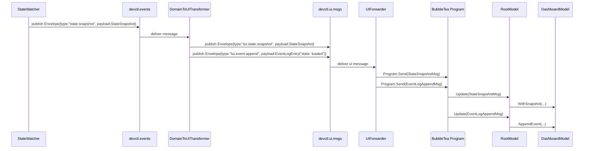
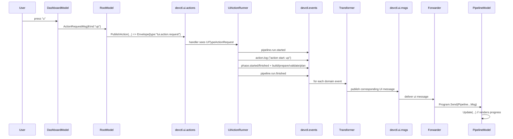

# Devctl fundamentals → events → UI messages (textbook walkthrough)

This article explains (in a “systems textbook” style) how `devctl`’s core runtime concepts (“fundamentals”) get translated into **domain events**, how those domain events get transformed into **UI messages**, and how the UI messages become **BubbleTea messages (`tea.Msg`)** that drive the TUI.

Where this gets interesting (and where designs often fray) is at the boundaries:

- Are events truly domain-level, or are they already UI-shaped?
- Is the UI *purely* a projection of events, or is it hiding real functionality?
- Are there hidden couplings (string parsing, naming conventions, time-based behavior) that make the system brittle?

This walkthrough tries to be precise about what happens, where, and why.

## Quick map of the pipeline (one page)

At a high level, the TUI process contains an in-memory message bus and several cooperating loops:

- **State polling loop**: periodically reads persisted runtime state from disk and emits “state snapshot” events.
- **UI action loop**: receives UI action requests (up/down/restart), runs the corresponding pipeline (plugins → plan → supervise), and emits events representing progress/results.
- **Domain → UI transformer**: turns domain events into UI messages.
- **UI forwarder**: turns UI messages into BubbleTea messages and `Send`s them into the BubbleTea program.
- **BubbleTea update loop**: reduces messages into UI state and renders.

If you only remember one diagram, make it this:

```mermaid
flowchart LR
  subgraph BubbleTea
    RM[RootModel.Update]
    DM[DashboardModel]
    EM[EventLogModel]
    PM[PipelineModel]
    SM[ServiceModel]
    PLM[PluginModel]
    RM --> DM
    RM --> EM
    RM --> PM
    RM --> SM
    RM --> PLM
  end

  subgraph Watermill Bus (in-memory)
    TopicEvents[TopicDevctlEvents\n\"devctl.events\"]
    TopicUIMsgs[TopicUIMessages\n\"devctl.ui.msgs\"]
    TopicUIActions[TopicUIActions\n\"devctl.ui.actions\"]
  end

  SW[StateWatcher] --> TopicEvents
  AR[UIActionRunner] --> TopicEvents
  TopicUIActions --> AR

  TopicEvents --> XFORM[DomainToUITransformer]
  XFORM --> TopicUIMsgs
  TopicUIMsgs --> FWD[UIForwarder]
  FWD --> RM
```

### “Fundamentals” (what counts, in this codebase)

In `devctl`, the most important runtime fundamentals that surface in the UI are:

- **Plugins and ops**: plugin processes implement a NDJSON stdio protocol; the engine calls ops like `config.mutate`, `build.run`, `prepare.run`, `validate.run`, `launch.plan`. See `devctl/pkg/runtime/*`, `devctl/pkg/engine/*`, `devctl/pkg/protocol/*`.
- **Launch plan**: a list of services to run (commands, cwd, env, health checks) produced by plugins. See `devctl/pkg/engine/types.go`.
- **Supervision and persisted state**: once services are running, `devctl` persists `.devctl/state.json` and logs under `.devctl/logs/`. See `devctl/pkg/supervise/supervisor.go`, `devctl/pkg/state/state.go`.
- **The “up/down/restart pipeline”**: action runner sequences config mutation → build → prepare → validate → launch plan → supervise → state save (or the inverse for down). See `devctl/pkg/tui/action_runner.go`.

The TUI converts these into:

- **Domain events** (topic `devctl.events`): “what happened” in the runtime.
- **UI messages** (topic `devctl.ui.msgs`): “what the UI should update”.
- **BubbleTea messages** (`tea.Msg`): typed Go structs that BubbleTea reducers consume.

## The message bus: what it is and what it isn’t

`devctl` uses Watermill’s in-process pub/sub (`gochannel`) as an internal message bus for the TUI:

- Code: `devctl/pkg/tui/bus.go`
- Topics: `devctl/pkg/tui/topics.go`

### API (important signatures)

The `Bus` is a thin wrapper:

```go
type Bus struct {
  Router     *message.Router
  Publisher  message.Publisher
  Subscriber message.Subscriber
}

func NewInMemoryBus() (*Bus, error)
func (b *Bus) AddHandler(name, topic string, handler func(*message.Message) error)
func (b *Bus) Run(ctx context.Context) error
```

The key detail: **handlers run inside the Watermill router** and are registered with `AddNoPublisherHandler`. Each handler manually `Ack()`s the message.

### Envelope: the common “wire format”

The bus carries JSON payloads. Both domain events and UI messages use the same wrapper:

- Code: `devctl/pkg/tui/envelope.go`

```go
type Envelope struct {
  Type    string          `json:"type"`
  Payload json.RawMessage `json:"payload,omitempty"`
}

func NewEnvelope(typ string, payload any) (Envelope, error)
func (e Envelope) MarshalJSONBytes() ([]byte, error)
```

This gives you:

- A single `type` discriminator string.
- A free-form `payload` (raw JSON), interpreted based on `type`.

**Important design implication:** type safety exists only at runtime, via `switch env.Type` plus `json.Unmarshal(env.Payload, &X)`. There’s no compile-time guarantee that every published type is handled by the transformer/forwarder/model.

### Check your understanding

1. Why is `Envelope.Payload` `json.RawMessage` instead of `any`?
2. Where do you pay the cost of JSON encoding/decoding, and how many times per message?
3. If a new `Type` is published but not handled, what happens today?

## Wiring: `devctl tui` as the composition root

The TUI command sets everything up:

- Code: `devctl/cmd/devctl/cmds/tui.go`

Key responsibilities:

1. Create the bus (`tui.NewInMemoryBus()`).
2. Register internal bus handlers:
   - `tui.RegisterDomainToUITransformer(bus)`
   - `tui.RegisterUIActionRunner(bus, RootOptions{...})`
   - `tui.RegisterUIForwarder(bus, program)`
3. Start the polling watcher:
   - `watcher := &tui.StateWatcher{RepoRoot, Interval, Pub: bus.Publisher}`
4. Run three loops concurrently (errgroup):
   - the Watermill router,
   - the state watcher loop,
   - the BubbleTea program.

### The three concurrent loops (a mental model)

This is the core scheduling story:

```text
goroutine A: bus.Run(ctx)
  - runs Watermill router event loops
  - invokes handlers for incoming messages

goroutine B: watcher.Run(ctx)
  - every refresh interval: read state, compute derived data, publish snapshot event

goroutine C: program.Run()
  - reads terminal input
  - processes messages (tea.Msg) sent by UIForwarder
  - renders frames
```

**Where the boundaries are:**

- Everything before the BubbleTea program is *event plumbing* and *background I/O*.
- Everything inside BubbleTea is *state reduction* and *rendering*.

### Check your understanding

1. Which goroutine actually executes `RegisterDomainToUITransformer`’s handler?
2. If state polling publishes faster than BubbleTea can render, where does backpressure show up (if at all)?

## Domain events: what exists and who publishes them

All domain events are published to `TopicDevctlEvents` (`"devctl.events"`).

Event type strings are declared in:

- Code: `devctl/pkg/tui/topics.go`

```go
const (
  DomainTypeStateSnapshot = "state.snapshot"
  DomainTypeServiceExit   = "service.exit.observed"
  DomainTypeActionLog     = "action.log"

  DomainTypePipelineRunStarted     = "pipeline.run.started"
  DomainTypePipelineRunFinished    = "pipeline.run.finished"
  DomainTypePipelinePhaseStarted   = "pipeline.phase.started"
  DomainTypePipelinePhaseFinished  = "pipeline.phase.finished"
  DomainTypePipelineBuildResult    = "pipeline.build.result"
  DomainTypePipelinePrepareResult  = "pipeline.prepare.result"
  DomainTypePipelineValidateResult = "pipeline.validate.result"
  DomainTypePipelineLaunchPlan     = "pipeline.launch.plan"
)
```

### Publisher #1: StateWatcher (polling fundamentals → snapshot events)

`StateWatcher` is the main “fundamental-to-event” translator for runtime state:

- Code: `devctl/pkg/tui/state_watcher.go`

What it does each tick:

1. Read plugin config (even if state doesn’t exist).
2. Check for state file existence: `.devctl/state.json` (via `state.StatePath(repoRoot)`).
3. If state exists:
   - Load it (`state.Load`),
   - Compute liveness of each PID (`state.ProcessAlive`),
   - Optionally detect transitions from alive → dead and emit `DomainTypeServiceExit`,
   - Read `/proc` stats (CPU%, RSS) for alive PIDs (`proc.ReadAllStats`),
   - Run health checks for services that have health config (TCP/HTTP),
   - Publish a `DomainTypeStateSnapshot` containing both raw state and derived fields.

#### The snapshot structure

`StateWatcher` publishes:

- Code: `devctl/pkg/tui/state_events.go`

```go
type StateSnapshot struct {
  RepoRoot     string
  At           time.Time
  Exists       bool
  State        *state.State
  Alive        map[string]bool
  Error        string
  ProcessStats map[int]*proc.Stats
  Health       map[string]*HealthCheckResult
  Plugins      []PluginSummary
}
```

Think of this as a **projection** of multiple sources:

- “Persisted truth” (state file) + “OS truth” (process aliveness, `/proc` stats) + “network truth” (health checks) + “config truth” (plugins).

#### Pseudocode of the tick loop

```pseudocode
function StateWatcher.Run(ctx):
  every Interval:
    plugins = readPluginsFromConfig()
    if stateFileMissing:
      lastAlive = nil; lastExists = false
      publish(StateSnapshot{Exists:false, Plugins:plugins})
      continue

    st = loadState()
    alive = map svcName -> ProcessAlive(pid)

    if lastExists && lastAlive != nil:
      for each svc in st.Services:
        if lastAlive[svc.Name] == true and alive[svc.Name] == false:
          publish(ServiceExitObserved{Name:svc.Name, PID:svc.PID, Reason:"process not alive"})

    stats = ReadAllStats(pids where alive)
    health = checkHealth(st.Services, alive)
    publish(StateSnapshot{Exists:true, State:st, Alive:alive, ProcessStats:stats, Health:health, Plugins:plugins})
```

#### Boundary note (design smell candidate)

`StateWatcher` lives under `pkg/tui/`, not `pkg/state/` or `pkg/engine/`. That’s a strong hint that the “domain events” are currently *TUI-driven domain projection*, not a UI that merely subscribes to a domain event stream produced elsewhere.

That may be fine for now—but it means:

- If you build a non-TUI frontend, you will likely duplicate this polling/derivation logic.
- “Domain event” semantics can drift toward “what the current UI happens to need”.

### Publisher #2: UIActionRunner (actions → pipeline events)

The action runner receives UI action requests and runs the “up/down/restart pipeline”:

- Code: `devctl/pkg/tui/actions.go` (publishes UI action request)
- Code: `devctl/pkg/tui/action_runner.go` (consumes requests, publishes domain events)

The bus topic split:

- UI publishes to `TopicUIActions` (`"devctl.ui.actions"`)
- Runner consumes from `TopicUIActions`, then publishes to `TopicDevctlEvents` (`"devctl.events"`)

#### Action request format

```go
type ActionRequest struct {
  Kind    ActionKind `json:"kind"` // up|down|restart|stop
  At      time.Time  `json:"at"`
  Service string     `json:"service,omitempty"`
}
```

The UI calls:

```go
func PublishAction(pub message.Publisher, req ActionRequest) error
```

This packages the request as:

```json
{"type":"tui.action.request","payload":{"kind":"up","at":"...","service":""}}
```

and publishes it to topic `devctl.ui.actions`.

#### Runner behavior (high-level)

The runner does the following on receipt of a `tui.action.request`:

1. Validate/normalize the request.
2. Generate a `runID`.
3. Publish `DomainTypePipelineRunStarted` containing the phase list the UI should expect.
4. Publish a `DomainTypeActionLog` line (“action start: up”).
5. Execute the action’s pipeline:
   - `runDown` for `down`
   - `runUp` for `up`
   - `down` then `up` for `restart`
6. Publish `DomainTypePipelineRunFinished` and a log line marking ok/failure.

#### Pipeline phases as first-class events

The phases that the runner publishes are from `tui.PipelinePhase` (not from `engine`):

- Code: `devctl/pkg/tui/pipeline_events.go`

```go
const (
  PipelinePhaseMutateConfig = "mutate_config"
  PipelinePhaseBuild        = "build"
  PipelinePhasePrepare      = "prepare"
  PipelinePhaseValidate     = "validate"
  PipelinePhaseLaunchPlan   = "launch_plan"
  PipelinePhaseSupervise    = "supervise"
  PipelinePhaseStateSave    = "state_save"

  PipelinePhaseStopSupervise = "stop_supervise"
  PipelinePhaseRemoveState   = "remove_state"
)
```

The runner emits:

- `pipeline.phase.started` at phase start
- `pipeline.phase.finished` at phase end (duration, ok, error)
- plus phase result payloads (build/prepare/validate/launch plan)

#### How the runner invokes “fundamentals” (engine/runtime/supervise/state)

Inside `runUp`:

1. `config.LoadOptional` loads `.devctl.yaml` (or equivalent path).
2. `discovery.Discover` produces plugin specs for the repo.
3. `runtime.NewFactory(...).Start(ctx, spec)` starts each plugin process and reads the NDJSON handshake.
4. `engine.Pipeline{Clients: clients}` calls plugin ops in order:
   - `MutateConfig` (apply patches)
   - `Build`
   - `Prepare`
   - `Validate`
   - `LaunchPlan`
5. `supervise.New(...).Start(ctx, plan)` starts services and waits for health readiness.
6. `state.Save(repoRoot, st)` writes `.devctl/state.json`.

Inside `runDown`:

1. `state.Load(repoRoot)` to learn what services exist.
2. `supervise.New(...).Stop(ctx, st)` terminates service process groups.
3. `state.Remove(repoRoot)` removes `.devctl/state.json`.

#### Pseudocode of event emission for one phase

```pseudocode
publish(PipelinePhaseStarted{Phase:"build"})
result = engine.Build(config)
publish(PipelineBuildResult{Steps:..., Artifacts:...})
publish(PipelinePhaseFinished{Phase:"build", Ok:true, DurationMs:...})
```

This makes the pipeline view renderable as a pure projection of these events.

### Check your understanding

1. Why does the runner publish both `PipelinePhaseFinished` and `PipelineBuildResult`?
2. If `Validate` returns `Valid=false`, how does the runner represent that in events?
3. Where is plugin op ordering defined?

## Domain → UI transformation: shaping events into UI messages

The transformer subscribes to `devctl.events` and publishes to `devctl.ui.msgs`:

- Code: `devctl/pkg/tui/transform.go`

It does three jobs:

1. Decode `Envelope`.
2. For supported domain event types, decode payload to a typed struct.
3. Publish a *UI envelope* with a UI type string and UI-shaped payload.

### UI message types

Declared in `devctl/pkg/tui/topics.go`:

```go
const (
  UITypeStateSnapshot = "tui.state.snapshot"
  UITypeEventAppend   = "tui.event.append"
  UITypeActionRequest = "tui.action.request"
  UITypePipelineRunStarted     = "tui.pipeline.run.started"
  UITypePipelineRunFinished    = "tui.pipeline.run.finished"
  UITypePipelinePhaseStarted   = "tui.pipeline.phase.started"
  UITypePipelinePhaseFinished  = "tui.pipeline.phase.finished"
  UITypePipelineBuildResult    = "tui.pipeline.build.result"
  UITypePipelinePrepareResult  = "tui.pipeline.prepare.result"
  UITypePipelineValidateResult = "tui.pipeline.validate.result"
  UITypePipelineLaunchPlan     = "tui.pipeline.launch.plan"
)
```

### The transform mapping (conceptual table)

| Domain envelope type | Payload struct | UI envelope type | UI payload |
|---|---|---|---|
| `state.snapshot` | `tui.StateSnapshot` | `tui.state.snapshot` | same snapshot |
| `service.exit.observed` | `tui.ServiceExitObserved` | `tui.event.append` | derived text log entry |
| `action.log` | `tui.ActionLog` | `tui.event.append` | derived text log entry |
| `pipeline.run.started` | `tui.PipelineRunStarted` | `tui.pipeline.run.started` | same |
| `pipeline.run.finished` | `tui.PipelineRunFinished` | `tui.pipeline.run.finished` | same |
| `pipeline.phase.started` | `tui.PipelinePhaseStarted` | `tui.pipeline.phase.started` | same |
| `pipeline.phase.finished` | `tui.PipelinePhaseFinished` | `tui.pipeline.phase.finished` | same |
| `pipeline.build.result` | `tui.PipelineBuildResult` | `tui.pipeline.build.result` | same |
| `pipeline.prepare.result` | `tui.PipelinePrepareResult` | `tui.pipeline.prepare.result` | same |
| `pipeline.validate.result` | `tui.PipelineValidateResult` | `tui.pipeline.validate.result` | same |
| `pipeline.launch.plan` | `tui.PipelineLaunchPlan` | `tui.pipeline.launch.plan` | same |

### The “event log append” as a UI projection

Notice what’s happening for some types:

- `service.exit.observed` becomes a *log entry string*.
- `action.log` becomes a *log entry string*.
- `state.snapshot` also results in an *extra* `tui.event.append` message describing state availability (loaded/missing/error).

This is a concrete place where “domain” and “UI” responsibilities intertwine:

- The transformer decides what human-readable line to show.
- The transformer decides *when* to show it (e.g., every snapshot tick).

In a strict layered design, these might live:

- Either fully in the domain stream (domain publishes a `LogLine` event),
- Or fully in the view model (UI decides how to render a snapshot without emitting extra events).

Here, the transformer mixes both.

### Check your understanding

1. Why does the transformer publish two UI messages for a single `state.snapshot`?
2. What is the benefit of having “log entry” as a separate UI message type?
3. If you wanted multiple UIs (TUI + web), where should formatting of log text live?

## UI → BubbleTea forwarder: turning UI messages into `tea.Msg`

The UI forwarder subscribes to `devctl.ui.msgs` and uses `Program.Send`:

- Code: `devctl/pkg/tui/forward.go`

This is the final translation boundary:

1. Decode UI `Envelope`.
2. Decode payload into typed structs.
3. Wrap them in BubbleTea message structs and `Send` them.

### BubbleTea message types

- Code: `devctl/pkg/tui/msgs.go`

Examples:

```go
type StateSnapshotMsg struct { Snapshot StateSnapshot }
type EventLogAppendMsg struct { Entry EventLogEntry }
type PipelinePhaseFinishedMsg struct { Event PipelinePhaseFinished }
```

**Design note:** there is no generic `EnvelopeMsg`. Messages are “already decoded” by the time they enter BubbleTea, which is good for model simplicity.

### Check your understanding

1. Why is it useful that BubbleTea receives typed structs instead of JSON?
2. If you added a new UI message type, where must you update code so BubbleTea can see it?

## BubbleTea architecture: RootModel as a message router

Once messages are inside BubbleTea, the critical “routing layer” is `RootModel.Update`:

- Code: `devctl/pkg/tui/models/root_model.go`

`RootModel` is both:

- a UI state container (active tab, window size, status line),
- and a router that forwards messages to submodels.

### Important routing behavior

1. **State snapshot fans out** to multiple models:
   - dashboard: service table
   - service view: log paths, liveness, etc
   - plugins: plugin list summaries
2. **Event log append** updates:
   - the event log view,
   - and the dashboard “recent events preview”,
   - and the root status line (by parsing strings; more on that later).
3. **Pipeline messages** primarily go to the pipeline view, but also update dashboard pipeline status.

### Action requests from the UI

UI interactions produce `tui.ActionRequestMsg` (BubbleTea message), and `RootModel.Update` converts them into a bus publish:

- `PublishAction` function is injected into the root model at construction time (`tui.go`).

This indirection is nice:

- the UI code doesn’t know about Watermill topics,
- it only knows “publishAction(req)”.

But: `RootModel` also emits user-facing log lines like “action requested: up” and “action publish failed: …” based on publish success.

### Check your understanding

1. What models need state snapshots, and why?
2. Why does `RootModel` handle pipeline messages instead of letting `PipelineModel` subscribe directly?

## How events become UI output (concrete flows)

This section traces the exact end-to-end message flow for the main user-visible behaviors.

### Flow A: periodic state updates (polling)

**Source:** `StateWatcher`

**User-visible effects:**

- Dashboard updates service list and health/CPU/MEM.
- Service view can render logs for a selected service.
- Plugins view lists configured plugins.
- Event log view receives “state: loaded/missing/error” lines.

Sequence:



**Robustness note:** because `StateWatcher` ticks frequently, the transformer’s extra “state: loaded” event can become extremely spammy. This is a potential “fraying seam”: a UI-logging concern has been attached to a high-frequency polling path.

### Flow B: service exits (alive → dead)

**Source:** `StateWatcher` transition detection.

Sequence:

1. On tick N, service PID is alive.
2. On tick N+1, PID is not alive.
3. `StateWatcher` publishes `service.exit.observed`.
4. Transformer converts it into an `EventLogEntry` line.
5. UI shows it in event log and dashboard preview.

**Important detail:** This is edge-triggered (only on transitions), unlike snapshots (level-triggered).

### Flow C: user hits “u” (up) on the dashboard

**Source:** `DashboardModel.Update` emits `ActionRequestMsg`.

Sequence:



**Key observation:** the “pipeline progress view” is a *pure projection* of events the runner emits, which is a good separation—except for missing wiring discussed later.

## Where the design starts to fray (robustness and boundary leaks)

This section is intentionally critical: it identifies seams where abstractions leak across layers or where incomplete plumbing can surprise you.

### 1) UI performs domain actions directly (hidden functionality in UI)

In `DashboardModel`, the “kill service” feature (`x`) calls `syscall.Kill(pid, SIGTERM)` directly and then logs a UI event:

- Code: `devctl/pkg/tui/models/dashboard_model.go`

This bypasses:

- the action runner,
- the pipeline event stream,
- any domain-level authorization/validation,
- and any consistent event semantics.

Why this matters:

- The event log line created here is indistinguishable from domain-originated log lines.
- The action runner has no chance to report progress, failure, or to coordinate state cleanup.

If you’re looking for “functionality hidden in the UI,” this is a prime example.

### 2) “Stop service” action exists in UI but is not implemented in the runner

`ActionKind` declares `ActionStop`, and `ServiceModel` emits it (`s` key):

- Code: `devctl/pkg/tui/actions.go` (`ActionStop`)
- Code: `devctl/pkg/tui/models/service_model.go` (emits `ActionStop`)

But `RegisterUIActionRunner` only implements `down`, `up`, `restart`.

Consequence:

- The UI presents an affordance whose semantics are not implemented at the action runner boundary.
- The user will see “action failed: stop: unknown action: stop”.

This is another example of UI/design drifting out of sync with domain capability.

### 3) RootModel derives “status line” by parsing log text (stringly-typed coupling)

`RootModel` sets the status line by checking string prefixes of `EventLogEntry.Text`:

- Code: `devctl/pkg/tui/models/root_model.go`

This creates a fragile implicit contract:

- If the text changes (or is localized, or includes extra info), the status line logic breaks.
- The “meaning” of an event is encoded in human-readable prose instead of typed fields.

Better alternatives (conceptually):

- Add a typed UI message: `tui.StatusLineSetMsg{Ok:bool, Text:string}`.
- Or add a structured domain event for action completion with a clear status enum.

### 4) High-frequency polling + transformer-generated logs can flood the event system

Because the transformer emits an extra log line on every state snapshot, event volume scales with the refresh interval.

Where it hurts:

- `EventLogModel.Append` refreshes viewport content frequently; extra events increase CPU work and drop older information.
- The dashboard “recent events” becomes dominated by “state: loaded” instead of meaningful events.

A rule of thumb:

- **Level-triggered signals** (snapshots) should usually not be converted into **edge-triggered logs** unless throttled or transition-detected.

### 5) Missing plumbing for “live pipeline output” and “config patches”

`PipelineModel` is prepared to handle:

- `PipelineLiveOutputMsg`
- `PipelineConfigPatchesMsg`
- `PipelineStepProgressMsg`

But:

- There are no corresponding domain types in `topics.go`.
- `transform.go` does not publish UI messages for these.
- `forward.go` does not forward such UI messages into BubbleTea.
- The action runner does not emit them (it calls `engine.Pipeline.Build/Prepare` as blocking calls).

This is a classic “design fray” symptom: UI features exist as data structures and reducers, but the event pipeline does not produce the data.

### 6) “Domain events” are owned by the TUI package

Most event structures and the main publishers (`StateWatcher`, `UIActionRunner`) live under `devctl/pkg/tui/`.

Tradeoff:

- Fast iteration (TUI drives what it needs).
- But weak layering: the UI boundary contains “domain semantics” and side-effectful runtime orchestration.

If your goal is to make the system more robust long-term, a likely refactor direction is to:

- move event definitions and publishers into a non-UI package (e.g., `pkg/events` or `pkg/domain`),
- treat the TUI as a consumer that *only* subscribes.

### Check your understanding

1. Which of the issues above are “bugs” vs “architectural debt”?
2. How would you redesign the kill/stop flow so it is event-driven and consistent with `up/down`?
3. What would be the minimal change to stop snapshot-log spam without a larger refactor?

## Exercises (to cement the mental model)

1. Trace the exact chain of functions called when you press `u` on the dashboard:
   - which file emits which message type at each step?
2. If you introduce a new domain event `pipeline.live_output`, list all the places you must touch for it to render in the pipeline view.
3. Identify one place where a *single* missing `default:` clause could hide a bug for weeks. Why?

## Appendix: plugin protocol and the “real fundamentals” behind build/prepare/validate

The pipeline’s “build/prepare/validate/launch plan” phases are backed by the NDJSON stdio protocol:

- Protocol frame types: `devctl/pkg/protocol/types.go`
- Runtime client (handshake, request/response, event streaming): `devctl/pkg/runtime/client.go`
- Engine pipeline (merge semantics, op ordering): `devctl/pkg/engine/pipeline.go`

At a high level:

- Plugins declare supported ops in the handshake.
- The engine calls ops on all plugins in priority order.
- Results are merged (with “strict mode” collision handling).

This is why `PipelineBuildResult` can show multiple “steps”: each plugin can return steps, and the engine merges them by name.

### Appendix A: Domain event contract catalog (what each event means)

This section treats the domain event stream as an API. For each event, we describe:

- **Producer** (who publishes it)
- **Payload type**
- **Semantics** (what it means)
- **Ordering expectations** (what should come before/after)

#### A.1 `state.snapshot` (`DomainTypeStateSnapshot`)

- **Producer:** `StateWatcher.publishSnapshot` in `devctl/pkg/tui/state_watcher.go`
- **Payload:** `tui.StateSnapshot` (`devctl/pkg/tui/state_events.go`)

Semantics:

- A point-in-time sample of the “system” as observed from disk + OS + health checks.
- `Exists=false` means `.devctl/state.json` is missing (system is “stopped”).
- `Exists=true` + `Error!=""` means state exists but could not be read/parsed.
- `Exists=true` + `State!=nil` means loaded state; `Alive` is best-effort per PID.

Ordering expectations:

- Level-triggered: you will see this repeatedly; don’t assume each snapshot implies a transition.
- If state disappears, you should see an `Exists=false` snapshot soon after `down`.

Potential pitfalls:

- `ProcessStats` and `Health` are computed at snapshot time; they can lag (polling) and can be missing for short-lived processes.
- Health checks do not use request-scoped context; slow networks can elongate the tick duration.

Textbook questions:

1. In a polling system, what differentiates a “snapshot” event from a “transition” event?
2. If `Alive[name]` is `false` but the process is actually alive, what layers could be wrong (state file, PID reuse, `/proc`, permissions)?

#### A.2 `service.exit.observed` (`DomainTypeServiceExit`)

- **Producer:** `StateWatcher.publishServiceExit` in `devctl/pkg/tui/state_watcher.go`
- **Payload:** `tui.ServiceExitObserved` (`devctl/pkg/tui/state_events.go`)

Semantics:

- An edge-triggered observation: a service that was alive in the previous snapshot is not alive now.
- This is not necessarily a *clean* exit; the watcher’s default reason is “process not alive”.

Ordering expectations:

- Only emitted when `lastAlive` exists; the watcher resets `lastAlive` when state disappears.
- Can appear before/after the corresponding snapshot that shows the process as dead (depending on delivery order).

#### A.3 `action.log` (`DomainTypeActionLog`)

- **Producer:** `publishActionLog` in `devctl/pkg/tui/action_runner.go`
- **Payload:** `tui.ActionLog` (`devctl/pkg/tui/action_events.go`)

Semantics:

- A human-oriented log line representing action runner progress (“action start”, “action ok”, “action failed”).
- Currently used as a generic narration channel.

Robustness pitfall:

- Other parts of the UI interpret meaning via *string prefixes* (see RootModel status line).

#### A.4 Pipeline run lifecycle events

- **Producers:** `publishPipelineRunStarted`, `publishPipelineRunFinished` in `devctl/pkg/tui/action_runner.go`
- **Payloads:** `tui.PipelineRunStarted`, `tui.PipelineRunFinished` (`devctl/pkg/tui/pipeline_events.go`)

Semantics:

- A run is identified by `RunID`.
- The UI should treat `RunID` as the correlation key for all subsequent pipeline events.

Ordering expectations:

- `pipeline.run.started` first.
- Then some number of phases and results.
- Then `pipeline.run.finished` last.

Important fields:

- `PipelineRunStarted.Phases` is the UI’s “expected phase order” and can differ by action kind (e.g., `down` only has stop/remove).
- `PipelineRunFinished.Ok` indicates overall run success; `Error` contains the final error string.

#### A.5 Pipeline phase events

- **Producers:** `publishPipelinePhaseStarted`, `publishPipelinePhaseFinished` in `devctl/pkg/tui/action_runner.go`
- **Payloads:** `tui.PipelinePhaseStarted`, `tui.PipelinePhaseFinished`

Semantics:

- These are the UI’s primary progress events.
- A phase can “finish” with `Ok=false` and `Error`, which usually aborts the run.

Ordering expectations:

- For each phase: started → (optional result events) → finished.

Edge case:

- If event publication fails (publishing errors are often ignored with `_ =`), the UI can see an incomplete phase (started but never finished).

#### A.6 Pipeline result events

- **Producer:** action runner
- **Payloads:** `tui.PipelineBuildResult`, `tui.PipelinePrepareResult`, `tui.PipelineValidateResult`, `tui.PipelineLaunchPlan`

Semantics:

- `Build`/`Prepare`: merged step results and artifacts across plugins (engine merge rules).
- `Validate`: merged errors/warnings across plugins; if `Valid=false`, the runner treats it as a hard failure.
- `LaunchPlan`: a list of service names to be supervised (note: only names are forwarded, not full commands).

Textbook questions:

1. Why might you want full launch plan details in events rather than only service names?
2. Should validation warnings fail the pipeline? Where is that policy expressed today?

### Appendix B: UI message and BubbleTea message catalog

The UI message bus types (`UIType*`) are an intermediate format. BubbleTea never sees them directly; it sees the typed `tui.*Msg` structs from `devctl/pkg/tui/msgs.go`.

This is the chain to keep in mind:

```text
Domain Envelope(type=DomainTypeX, payload=structX)
  -> Transformer publishes UI Envelope(type=UITypeY, payload=structY)
    -> Forwarder sends BubbleTea msg: tui.YMsg{...}
```

#### B.1 What the forwarder supports today

- Code: `devctl/pkg/tui/forward.go`

Supported UI types include:

- `tui.state.snapshot` → `tui.StateSnapshotMsg` → `RootModel.Update` fans out to dashboard/service/plugins.
- `tui.event.append` → `tui.EventLogAppendMsg` → `RootModel.Update` → event log + dashboard preview.
- Pipeline run/phase/result types → pipeline/dashboard updates.

Notably absent (prepared in UI model, but not wired):

- `PipelineLiveOutputMsg`
- `PipelineConfigPatchesMsg`
- `PipelineStepProgressMsg`

#### B.2 Who consumes which BubbleTea messages

- Code: `devctl/pkg/tui/models/root_model.go`

| BubbleTea msg | RootModel behavior | Downstream model |
|---|---|---|
| `StateSnapshotMsg` | updates multiple submodels | dashboard, service, plugins |
| `EventLogAppendMsg` | append + status line parsing | events, dashboard |
| `PipelineRunStartedMsg` | dashboard pipeline status + forward to pipeline | pipeline, dashboard |
| `PipelinePhaseStartedMsg` | dashboard phase + forward to pipeline | pipeline, dashboard |
| `Pipeline*ResultMsg` | forward to pipeline | pipeline |
| `ActionRequestMsg` | publish to bus (UI actions topic) | action runner |

### Appendix C: Reliability and error handling (silent failure modes)

If you’re evaluating robustness, pay attention to what errors are:

- surfaced as events/logs,
- returned and acted upon,
- or silently ignored.

#### C.1 Handler errors + NopLogger

The bus is created with `watermill.NopLogger{}` (`devctl/pkg/tui/bus.go`).

Implication:

- If a Watermill handler returns an error, visibility depends on Watermill’s internal behavior and logging; with a NopLogger, many failures can become invisible.

This matters because:

- `transform.go` returns errors on unmarshal/publish failures.
- `forward.go` returns errors on unmarshal failures.

If those errors are not logged, the UI can simply “stop updating” without an obvious explanation.

Textbook questions:

1. What are the pros/cons of “fail fast” vs “best effort” in message transformers?
2. Where should you surface these errors so a user can act on them (event log, stderr, both)?

#### C.2 Publish errors are frequently discarded

The action runner often uses `_ = publish...` (ignoring errors). Example: `publishPipelineRunStarted`, `publishActionLog`, etc.

Implication:

- UI state can become inconsistent because “start” and “finish” are not guaranteed to arrive together.

#### C.3 Cancellation and timeouts

`StateWatcher.emitSnapshot` does not use `ctx` for I/O operations (health checks use fixed 500ms timeouts without cancellation).

Implication:

- On shutdown, snapshot work may continue briefly.
- Under load, ticks can drift (you can observe the system at irregular intervals).

### Appendix D: Refactor vectors (ways to make the boundary more robust)

These are not “do this now” prescriptions, but common patterns that address the fraying seams described above.

1. **Move domain event definitions out of `pkg/tui/`**
   - Create a `pkg/events` (or similar) for event structs + type constants.
   - Allow multiple frontends to reuse the same event contract.
2. **Replace string parsing with typed status events**
   - Add a dedicated UI message for status line updates.
3. **Throttled or transition-based snapshot logging**
   - Emit log entries only on state transitions (missing→loaded, loaded→missing, error changes), not on every tick.
4. **Implement `stop` as a proper domain action**
   - Add runner support for `ActionStop` and publish consistent phase/result events.
5. **Wire planned pipeline “live output”**
   - Extend engine/runtime to use streaming events (protocol `event` frames) during `build.run` / `prepare.run`.
   - Add domain event types + transformer + forwarder mapping.
