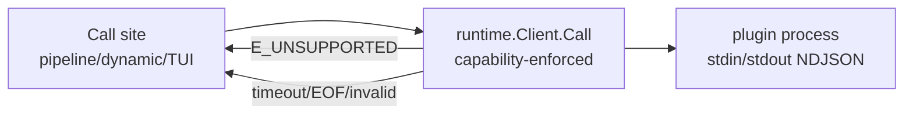

# Safe plugin invocation and capability enforcement (long-term pattern)

## Executive Summary

devctl’s plugin protocol is intentionally small: plugins self-declare capabilities in the handshake and then devctl calls request/response ops (and optionally starts streams). The practical failure mode is also simple: **devctl calls an op a plugin doesn’t support** (or the plugin ignores unknown ops), so the call blocks until timeout and can stall startup or break unrelated subsystems.

The current codebase already demonstrates both ends of this spectrum:
- “Good”: the pipeline (`devctl/pkg/engine/pipeline.go`) consistently gates plugin calls with `Client.SupportsOp(op)`.
- “Bad”: dynamic command discovery (`devctl/cmd/devctl/cmds/dynamic_commands.go`) calls `commands.list` unconditionally for every plugin, and `main.go` runs that discovery before *every* command, including internal wrapper commands like `__wrap-service`.

This design doc proposes a long-term, robust pattern that minimizes regressions:

1) **Make safe invocation the default** at the lowest reasonable level:
   - add capability-aware behavior to `runtime.Client` (or a mandatory wrapper) so “unsupported op” becomes a fast, local decision rather than a network/process round-trip.
2) **Standardize required vs optional invocation semantics**:
   - one call path explicitly “requires op support” (errors if not supported),
   - another explicitly “optional” (skips if not supported).
3) **Apply phase-appropriate timeout policies** (especially for startup UX like command discovery).
4) **Add conformance tooling** to catch “never responds / stdout contamination / unsupported handling” early.

Together, these changes turn “remember to call SupportsOp everywhere” into a system invariant.

## Problem Statement

### The class of issues

devctl’s protocol capabilities are self-declared (handshake `capabilities.ops/streams/commands`), but `runtime.Client.Call` and `StartStream` do not enforce those capabilities. That means every call site must remember to:
- check the right capability field(s),
- decide whether unsupported should be “skip” or “error”,
- choose an appropriate deadline to bound the call,
- and provide actionable error messages.

If any call site forgets, devctl can:
- stall startup (worst when the forgotten call happens during CLI initialization),
- hang until a deadline fires (or hang forever if a deadline is missing),
- or cause secondary failures (e.g., supervisor wrapper missing its ready-file deadline).

### Concrete observed failure in this repo

The comprehensive fixture (`setup-comprehensive-fixture.sh`) includes a `logger` plugin that:
- declares no ops (`ops: []`),
- and never responds to unknown ops (consumes stdin forever).

Dynamic command discovery calls `commands.list` unconditionally for all plugins (3s timeout per plugin). Since `devctl/cmd/devctl/main.go` runs dynamic discovery before executing any command, the `devctl __wrap-service` wrapper also pays this cost. `supervise.Supervisor` waits only 2 seconds for the wrapper to write a ready file, so the wrapper gets killed and `devctl up` fails with:
- `wrapper did not report child start`

Even when not fatal, the general symptom is “mysterious startup slowness” and timeouts.

### Why this is a long-term risk

Today, the number of `Call` and `StartStream` call sites is small. As devctl grows (more UI features, log streaming, plugin-defined commands), the number of call sites will increase, and each new call site is another chance to reintroduce the bug class.

This is exactly the kind of “paper cut” that should be prevented by architecture rather than by code review vigilance.

## Proposed Solution

The robust pattern is a layered “safe by default” approach:

1) **Protocol contract clarity**: define exactly what “capabilities” mean for ops, streams, and commands, and how devctl interprets them.
2) **Runtime-level enforcement**: provide capability-aware invocation APIs that are hard to misuse.
3) **Call-site conventions**: call sites express intent explicitly (required vs optional, timeout class).
4) **Tooling and tests**: ensure plugins behave well (always respond; don’t contaminate stdout) and devctl doesn’t regress.

### 0) Current state (codebase inventory and gap analysis)

This section is intentionally concrete: file names, symbols, and what is or isn’t gated today.

#### 0.1 Where plugin calls happen today

As of now, all production `.Call(...)` invocations in the Go code live in two places:

1) Pipeline ops (correctly gated)
   - file: `devctl/pkg/engine/pipeline.go`
   - pattern: checks `Client.SupportsOp("<op>")` before calling `Client.Call(...)` for:
     - `config.mutate`
     - `build.run`
     - `prepare.run`
     - `validate.run`
     - `launch.plan`

2) Dynamic commands (not gated)
   - file: `devctl/cmd/devctl/cmds/dynamic_commands.go`
   - calls without capability gating:
     - `commands.list` (during CLI initialization; 3s timeout per plugin)
     - `command.run` (when a dynamic command is invoked; timeout = `--timeout`)
   - additional foot-gun: command discovery uses `context.Background()` rather than a context annotated with `repo_root`, so `request.ctx.repo_root` is empty during `commands.list` (see `runtime.requestContextFrom`).

Smoketests also call `ping` (e.g. `devctl/cmd/devctl/cmds/smoketest.go`), but that is not user-facing behavior.

#### 0.2 Streams are implemented in runtime but not used in production yet

`runtime.Client.StartStream` is implemented (`devctl/pkg/runtime/client.go`) and used in tests, but no production code calls it today. This is precisely why this is worth addressing now: once TUI log-follow uses streams, missing gating will become a more frequent source of hangs.

#### 0.3 Handshake capability validation is intentionally minimal

`devctl/pkg/protocol/validate.go` validates:
- `type == "handshake"`
- `protocol_version == "v1"`
- `plugin_name != ""`

It does **not** validate:
- that capabilities exist,
- that `ops/streams/commands` are present,
- or that values are well-formed.

So “capabilities” must be treated as advisory/self-declared (and potentially missing).

#### 0.4 The runtime currently discards protocol error structure

If a plugin responds `ok=false` with:

```json
{"error":{"code":"E_UNSUPPORTED","message":"unsupported op"}}
```

`runtime.Client.Call` returns:

```go
errors.Errorf("%s: %s", resp.Error.Code, resp.Error.Message)
```

This means callers cannot reliably distinguish error codes without string parsing. Any long-term pattern that treats `E_UNSUPPORTED` specially should provide a typed error.

#### 0.5 Review of MO-009 recommendations (and how this design evolves them)

MO-009’s analysis doc proposes five recommendations. This design adopts their intent but strengthens the “regression resistance” where necessary.

1) Centralize “support check + call” into runtime helpers
   - Adopted and expanded.
   - Evolution: helpers are useful, but the robust default is runtime-level enforcement so call sites can’t forget.

2) Treat stream-producing operations as ops (and gate on SupportsOp)
   - Adopted.
   - Evolution: add an explicit `InvokeStream`/`SupportsStream` API before streams become widely used in production.

3) Make dynamic command discovery opt-in and capability-gated
   - Adopted.
   - Evolution: treat command discovery as startup UX; use short timeouts and avoid running it for internal commands.

4) Document and enforce “always respond with E_UNSUPPORTED”
   - Adopted in spirit, but not relied upon.
   - Evolution: devctl must remain robust even when plugins violate this (fixture demonstrates a plugin that never responds).

5) Timeouts should be proportional to phase
   - Adopted and made explicit via a “timeout class” concept.

### 1) Clarify and standardize capability semantics

This repo already documents the intended semantics in `devctl/pkg/doc/topics/devctl-plugin-authoring.md`:
- `capabilities.ops`: list of supported request operations (`request.op`)
- `capabilities.streams`: optional, stream-producing capabilities
- `capabilities.commands`: optional, names of plugin-defined CLI commands
- plugins should respond `ok=false` with `error.code="E_UNSUPPORTED"` for unknown ops

This design locks in the following semantics (system contract):

#### 1.1 `ops` is authoritative for request/response invocations

If a plugin does not list an op in `capabilities.ops`, devctl should treat it as unsupported and should not send the request except in explicitly “probe”/diagnostic flows.

Examples:
- pipeline ops: `config.mutate`, `build.run`, `prepare.run`, `validate.run`, `launch.plan`
- dynamic commands: `commands.list`, `command.run`
- stream-start ops: `logs.follow` (or similar; see below)

#### 1.2 `streams` is authoritative for event-stream compatibility

Streams have two concepts:
- the **stream-start request op** (what devctl calls to start a stream),
- the **event stream id** (returned by the plugin).

Because `runtime.StartStream(ctx, op, ...)` uses an operation name (a request), it should gate on `ops`. Additionally, `streams` can be used to prevent mismatches (“plugin says it can stream X”) and to help UIs present capabilities.

Recommended interpretation:
- `SupportsStartStream(op)` ≈ `op ∈ capabilities.ops`
- `SupportsStream(op)` ≈ `op ∈ capabilities.streams` (optional stricter check)

#### 1.3 `commands` is *not* the discovery protocol; it is metadata

`capabilities.commands` is only a list of names (no help text/args). It is useful as:
- a hint for whether dynamic command discovery is worth attempting,
- a UI/inspection surface,
- and a forward-compat path if devctl ever supports “command metadata in handshake”.

Dynamic discovery (today) is still performed by calling `commands.list` and must be gated by `ops`.

### 2) Runtime-level enforcement: make safe invocation hard to forget

The key decision is where to enforce capability checks:

#### 2.1 Option A (recommended): enforce in `runtime.Client` by default

Change behavior of:
- `(*client).Call(ctx, op, ...)`
- `(*client).StartStream(ctx, op, ...)`

So that if `!c.SupportsOp(op)`, they return quickly with a standardized “unsupported” error without writing to plugin stdin.

Why this is robust:
- It eliminates the entire class of “forgot to gate” bugs for any call site that uses runtime’s client.
- It aligns with the documented contract (“devctl will call you only for the ops you declare”).
- It makes “unsupported op” a local decision rather than a slow timeout.

Proposed error shape:

```go
// package runtime
var ErrUnsupportedOp = errors.New(protocol.ErrUnsupported) // "E_UNSUPPORTED"

type UnsupportedOpError struct {
  PluginID string
  Op       string
}

func (e UnsupportedOpError) Error() string {
  return fmt.Sprintf("%s: plugin=%q op=%q", protocol.ErrUnsupported, e.PluginID, e.Op)
}
```

Then:
- Optional callers treat `ErrUnsupportedOp` as “skip”.
- Required callers can surface it as an actionable error.

##### Diagram: safe-by-default invocation layering



#### 2.2 Option B: add helper wrappers and require them by convention

This is MO-009 Recommendation 1: add helpers like `CallIfSupported` / `RequireOp`.

This improves ergonomics, but it is easier to regress because `Client.Call` remains available and does not protect you.

It can still be part of the solution, but as a complement to Option A, not as a replacement.

### 3) Call-site conventions (required vs optional + timeout classes)

Even with runtime-level enforcement, call sites still need:
- consistent timeout policies,
- consistent behavior on unsupported (skip vs error),
- and consistent error messages.

Recommended convention (no dedicated helper API required):

- **Timeout class**: always wrap plugin calls in `context.WithTimeout`, using short deadlines for startup/UX (discovery/probes) and longer deadlines for pipeline/build-like ops.
- **Optional vs required**:
  - Optional operations should be guarded (`SupportsOp`) and/or treat `E_UNSUPPORTED` as “skip”.
  - Required operations should surface `E_UNSUPPORTED` as an actionable error.

#### 3.1 Proposed typed error mapping (API reference)

To avoid string parsing and to make error handling consistent across:
- “runtime short-circuit unsupported”
- “plugin responded E_UNSUPPORTED”

introduce a typed error that preserves `protocol.Error` fields:

```go
type ProtocolOpError struct {
  PluginID string
  Op       string
  Code     string // e.g. "E_UNSUPPORTED"
  Message  string
}

func (e ProtocolOpError) Error() string {
  return fmt.Sprintf("%s: plugin=%q op=%q: %s", e.Code, e.PluginID, e.Op, e.Message)
}
```

Then:
- `errors.As(err, &ProtocolOpError{})` works
- `err.Code == protocol.ErrUnsupported` becomes the canonical check for “unsupported”

### 4) Fix dynamic command discovery as a first-class “startup UX” subsystem

Independent of where capability checks live, dynamic command discovery has extra constraints:
- it runs at CLI initialization time today (pre-Cobra execution),
- it can block unrelated commands,
- and it should never block internal commands like `__wrap-service`.

The robust long-term pattern for dynamic command discovery is:

#### 4.1 Hard gate the discovery op

Only call `commands.list` if the plugin explicitly supports it:
- `SupportsOp("commands.list")` (or runtime-enforced `Call` returns E_UNSUPPORTED quickly)

Optional “hint”:
- if `len(handshake.Capabilities.Commands) == 0`, skip discovery (unless devctl is in a mode that explicitly wants to discover commands).

#### 4.2 Make discovery conditional by invocation context

Do not run command discovery when it cannot matter:
- when the requested command is `__wrap-service` (internal),
- potentially when the requested command is in a known set of built-ins.

This is the key to preventing “wrapper startup” regressions: the wrapper path must be minimal.

#### 4.3 Prefer parallelism and short timeouts

Command discovery should be treated like “UI sugar”:
- timeouts should be short (e.g., 250ms–500ms per plugin),
- discovery across plugins should be parallelized (bounded concurrency),
- results should degrade gracefully (missing plugin commands should not break `devctl up`, `devctl tui`, etc.).

Optionally, implement caching (requires invalidation rules); this is not required for the initial robustness win.

#### 4.4 Always include `repo_root` in discovery requests

Even if command discovery is “startup UX”, it still needs to behave predictably for repo-specific plugins.

Today, `AddDynamicPluginCommands` parses `--repo-root` to discover plugins, but then calls `commands.list` using a background context. Since `runtime.requestContextFrom(ctx)` populates `ctx.repo_root` from context, plugins receive an empty `repo_root` during `commands.list`.

Long-term robust behavior:
- construct a discovery context that includes `repo_root` (and optionally `dry_run`) before starting plugins and calling `commands.list`
- keep the deadline short (startup class), but do not drop essential context.

### 5) Add conformance tooling: fail fast on non-responsive plugins

Capability gating prevents “unsupported op” calls, but it does not prevent:
- plugins that claim support but hang,
- plugins that contaminate stdout,
- or plugins that respond with malformed JSON.

The repo already has smoketests that cover some timeout behavior (`smoketest-failures`).

Add (or extend) a command like:
- `devctl plugins check`

Checks (short deadlines):
- handshake parses and validates (`ValidateHandshake`)
- stdout stays protocol-clean (no contamination errors)
- for each op in `capabilities.ops`, plugin responds within a small bound to a probe call (plugin-specific, or a generic “ping” op if declared)
- optionally, probe that unknown ops return `E_UNSUPPORTED` quickly (best-effort; some plugins may not implement this, but then devctl should treat them as risky)

This tooling makes the “always respond to requests” rule enforceable in CI for plugin repos.

## Design Decisions

### Decision 1: Enforce capability checks as low as possible (runtime default)

Rationale:
- The biggest long-term risk is regressions from new call sites forgetting gating.
- Runtime is the narrow waist: most plugin calls flow through `runtime.Client`.
- Centralizing enforcement reduces cognitive load and makes future code review simpler (“timeouts and required/optional semantics”, not “did you remember SupportsOp?”).

### Decision 2: Keep both “optional” and “required” semantics explicit

Rationale:
- Some ops are truly optional (e.g., `commands.list`).
- Some ops are mandatory for a given workflow (e.g., if a user explicitly invokes a plugin-defined command, `command.run` must be supported by the chosen provider plugin).
- Mixing these semantics at call sites makes error handling ambiguous; an explicit API avoids that.

### Decision 3: Treat startup UX calls as first-class (short, parallel, non-blocking)

Rationale:
- Startup calls are on the critical path for every user action.
- A 3s per-plugin timeout is punishing and easily multiplied by N plugins.
- Most command discovery is “nice to have” and should degrade gracefully.

Definition (this doc’s terminology):
- **Startup UX calls** are calls performed during devctl process initialization (before the requested command’s `RunE` executes) whose purpose is to improve user experience (discoverability/autocomplete/help/inspection), not to execute the user’s requested “core action”.
- In this repo today, the canonical example is **dynamic command discovery** (`commands.list`) which runs in `main.go` before `rootCmd.Execute()`.

Why “UX” and not “just startup”:
- If these calls fail or time out, the correct behavior is usually “continue without the extra UX feature” (e.g., missing dynamic commands), rather than failing core commands like `up`, `tui`, or internal wrapper commands.
- Treating them as “UX” makes that degradation policy explicit and enforces short, bounded time budgets.

### Decision 4: Do not rely on plugins to always return `E_UNSUPPORTED`

Rationale:
- The comprehensive fixture intentionally demonstrates a plugin that does not respond.
- Even well-intentioned plugins can deadlock or crash.
- devctl must remain robust even when plugin authors make mistakes.

## Alternatives Considered

### Alternative A: “Just fix call sites” (no new runtime behavior)

Pros:
- minimal code churn

Cons:
- fragile: every future call site must remember to gate
- the same bug class will reappear (especially as streaming/log features expand)

This is appropriate as an immediate hotfix, but not as the long-term pattern.

### Alternative B: Helpers only (`CallIfSupported`, `RequireOp`)

Pros:
- improves readability; matches MO-009 Recommendation 1

Cons:
- still relies on convention; raw `Call` remains a foot-gun
- does not scale as well in a growing codebase without additional enforcement (lint/analyzer)

Good as a supplement, but insufficient as the single long-term safeguard.

### Alternative C: Make the handshake validation stricter (reject missing/empty capabilities)

Pros:
- encourages plugin authors to be explicit

Cons:
- not actually sufficient: a plugin can lie or hang even if it lists ops
- increases breakage risk for older plugins without improving devctl’s resilience

Better to treat missing capabilities as “supports nothing” and rely on runtime enforcement + timeouts.

### Alternative D: Separate wrapper binary (avoid Cobra init path entirely)

Pros:
- guarantees wrapper startup is minimal

Cons:
- adds build/distribution complexity (extra binary)
- not directly solving the general capability-check pattern (still needed elsewhere)

This may still be a good idea for supervision hardening, but it is orthogonal to capability enforcement and should not be required to achieve robustness here.

## Implementation Plan

The plan is phased to deliver immediate robustness while keeping risk low.

### Phase 0: Confirm invariants and document contracts (docs-only)
- Update the plugin authoring doc (if needed) to explicitly state:
  - ops are authoritative for request invocations,
  - `commands.list`/`command.run` must be listed in `capabilities.ops` when implemented,
  - streams require both an op and stream entry if using stricter checks.

### Phase 1: Runtime enforcement + wrapper API
- In `devctl/pkg/runtime/client.go`, change `Call` and `StartStream` to short-circuit unsupported ops:
  - if `!SupportsOp(op)`: return a structured `E_UNSUPPORTED` error without writing to stdin.
  - (Recommended) map protocol error frames to a typed error so call sites can detect `E_UNSUPPORTED` without string parsing.

### Phase 2: Migrate call sites
- Pipeline:
  - keep as-is (it already gates correctly); consider simplifying by relying on runtime enforcement as a backstop.
- Dynamic command discovery:
  - keep startup timeouts short
  - treat unsupported ops as “skip” where appropriate
  - make discovery conditional by argv (do not run for internal commands).
- Smoketests:
  - update test plugins to declare ops consistently (especially `ping`), if runtime enforcement makes tests stricter.

### Phase 3: Add conformance checks
- Add `devctl plugins check` that:
  - verifies handshake validity,
  - verifies responsiveness for declared ops under short deadlines,
  - emits actionable diagnostics on failure.
- Integrate into CI for plugin repos / fixtures if applicable.

### Phase 4 (optional): Improve command discovery UX
- Parallelize command discovery across plugins (bounded concurrency).
- Consider caching and invalidation to eliminate repeated startup calls.

## Open Questions

1) Should `StartStream` gate on `capabilities.streams` in addition to `capabilities.ops`, or should `streams` be treated as purely informational?
2) Should runtime enforce “a deadline must exist” (error if not), or should it silently apply defaults when missing?
3) Should dynamic command discovery run only when a user invokes an unknown command (lazy discovery), rather than always at startup?
4) How should devctl represent “unsupported” to callers:
   - a sentinel error value,
   - a typed error with plugin/op,
   - or `ok=false` protocol error mapping?

## Discussion / FAQ (addressing common follow-up questions)

### Can we eliminate `commands.list` and make handshake `capabilities.commands` the authoritative source?

Yes in principle, but not with the current protocol shape as-is.

Today:
- `capabilities.commands` is `[]string` (`protocol.Capabilities.Commands` in `devctl/pkg/protocol/types.go`).
- `commands.list` returns richer metadata (`name`, `help`, optional `args_spec`) that devctl uses to build Cobra commands (`devctl/cmd/devctl/cmds/dynamic_commands.go`).

So eliminating `commands.list` requires moving **command metadata** into the handshake (or another single-frame, handshake-adjacent channel). Options:

1) **Protocol change (breaking)**:
   - Change `capabilities.commands` from `[]string` to `[]CommandSpec` (or similar).
   - Pros: simplest conceptual model.
   - Cons: breaks existing plugins and Go types; requires a versioning plan (e.g., `protocol_version=v2`).

2) **Backward-compatible extension via `handshake.declares` (preferred for v1)**:
   - Keep `capabilities.commands` as names (or treat it as a hint).
   - Add a new structured field under `declares`, e.g.:
     - `declares.command_specs: [{name,help,args_spec}, ...]`
   - Pros: avoids changing `ProtocolVersion`; works with current `Handshake` type (`Declares map[string]any`).
   - Cons: requires Go-side parsing/validation of `declares.command_specs`.

3) **Config-driven commands (not protocol)**:
   - Put command specs in `.devctl.yaml` and use plugins only for execution (`command.run`).
   - Pros: no runtime discovery needed.
   - Cons: duplicates plugin knowledge in config; reduces “single source of truth”.

Even with handshake-based command specs, we still have to start each plugin process to read its handshake. That is usually acceptable if the handshake is fast and the process start is bounded, but it does not eliminate plugin process start cost entirely.

### Can we do the whole discovery pass once and reuse it downstream?

Yes, and this doc supports it (it’s a robustness and correctness win).

There are two separate “repetition” problems today:

1) **Repeated plugin config discovery**
   - `dynamic_commands.go` parses `--repo-root/--config` and runs plugin discovery at process init.
   - The dynamic command `RunE` function re-runs config load + plugin discovery again to find the provider plugin by ID.
   - Reusing a single, parsed “discovery result” (specs indexed by ID) would remove duplicated code paths and reduce mismatch risk.

2) **Repeated command discovery calls**
   - Today devctl calls `commands.list` once at startup, then does not need to call it again; the resulting Cobra command wiring is cached in-process.
   - If the design changes to handshake-based command specs, then the “discovery call” becomes “handshake read” (still once).

What “one pass” should mean in the robust design:
- Parse repo root/config once.
- Discover plugin specs once.
- Build a `map[id]PluginSpec` once and reuse it for:
  - dynamic command execution (provider lookup),
  - pipeline runs (start clients),
  - inspection (`plugins list`).

This also centralizes the request context fix: you can build a single “bootstrap context” that includes `repo_root` and reuse it everywhere (rather than sprinkling `context.Background()`).

Open question (engineering tradeoff):
- Whether to persist discovery results across *runs* (on-disk cache). That adds invalidation complexity; in-process reuse is the low-risk win.

### How does `logs.follow` work today if devctl isn’t using streams in production?

In the current codebase, it effectively doesn’t: `runtime.StartStream` exists and is tested, but there is no production subsystem using it yet.

What users experience today:
- Service logs are captured by the supervisor into `.devctl/logs/*.stdout.log` and `*.stderr.log`.
- The TUI tails those log files directly from disk (see `devctl/pkg/tui/models/service_model.go` and its `readTailLines` helper).
- There is no backend “log-follow via plugin stream” wiring yet.

So:
- `logs.follow` in the protocol docs and tests is a **planned** capability intended for future features (e.g., plugin-provided log aggregation or follow semantics).
- The “robust pattern” work is still important now, because once streams are used in production, missing capability checks become a recurring hang source.

### In Decision 3: what exactly are “startup UX calls”?

They are “startup” in timing, but “UX” in intent.

- Timing: executed during program initialization, before the target Cobra command runs.
- Intent: improve discoverability/help/inspection (e.g., dynamic command wiring), not to perform the user’s requested core action.

Why the distinction matters:
- If a “startup UX call” fails, the correct behavior is usually “continue without that enhancement”.
- If a “core startup call” fails (e.g., handshake for a plugin required for `devctl up`), the correct behavior is to fail the command.

Today, the biggest bug class comes from treating dynamic command discovery like a “core startup call” (it runs unconditionally in `main.go`), even though it should be best-effort and should not block internal commands like `__wrap-service`.

## Appendix A: Make repo/plugin context explicit (reduce context.Value usage)

This appendix captures a possible follow-up refactor direction: eliminate the need to pass repo-root and other “request metadata” through `context.Context` values, and instead make it explicit in objects/params.

### A.1 The problem with context.Value for repo/plugin metadata

Today, `runtime.requestContextFrom(ctx)` builds a `protocol.RequestContext` from:
- `ctx.Deadline()` (deadline_ms)
- `runtime.repoRootFromContext(ctx)` / `cwdFromContext(ctx)` / `dryRunFromContext(ctx)` (values stored via `context.WithValue`)

This creates a fragile coupling:
- If a call site uses `context.Background()` (as `dynamic_commands.go` currently does), plugins silently receive an empty `repo_root`.
- The presence/absence of repo metadata is not visible at the `Call(...)` call site.

Long-term, it’s usually better to treat `context.Context` as “control-plane only”:
- cancellation
- deadlines
- tracing

and to pass request metadata explicitly.

### A.2 What is `Client` (and why do we have multiple clients)?

In this codebase:
- A **plugin** is an executable process that speaks the NDJSON protocol over stdin/stdout.
- A `runtime.Client` is a Go handle to one running plugin process:
  - it owns the stdin writer,
  - it runs read loops on stdout/stderr,
  - it correlates request_id -> response,
  - it optionally multiplexes stream events by stream_id,
  - and it can terminate the plugin process group on close.

We have **multiple clients** because devctl supports:
- multiple plugins configured in `.devctl.yaml`,
- ordered by priority,
- merged deterministically (config patches, build/prepare steps, services).

So a typical pipeline run uses `[]runtime.Client`:
- each client represents one plugin process,
- engine/pipeline iterates over them in order and calls the ops each plugin supports.

This multi-client architecture also enables “stacking”:
- org defaults plugin + repo plugin + local overrides plugin, etc.

### A.3 What should “Meta” be in the client?

When devctl sends a request, it includes a `protocol.RequestContext`:

```go
type RequestContext struct {
  RepoRoot   string
  Cwd        string
  DeadlineMs int64
  DryRun     bool
}
```

Today, most of this comes from `context.Context` values. Instead, introduce an explicit “request metadata” (Meta) object and make it the source of truth:

```go
type RequestMeta struct {
  RepoRoot string
  Cwd      string
  DryRun   bool
}
```

Where Meta lives:

1) **On the client (recommended)**: make clients “repo-bound”.
   - A client is created for a specific repo-root and carries that Meta for all calls.
   - Call sites cannot forget to set repo_root because they never pass it through context.

2) **On each call**: `Call(ctx, meta, op, ...)`.
   - More explicit, but more verbose.

In either approach, `context.Context` remains for deadlines and cancellation.

### A.4 What is requestContext (and how to build it from meta)?

`protocol.RequestContext` is the on-the-wire request metadata included in every request frame. It should be constructed from:
- `RequestMeta` (repo_root/cwd/dry_run), and
- the deadline extracted from `ctx.Deadline()` (deadline_ms).

Canonical construction:

```go
func requestContext(meta RequestMeta, ctx context.Context) protocol.RequestContext {
  rc := protocol.RequestContext{
    RepoRoot: meta.RepoRoot,
    Cwd:      meta.Cwd,
    DryRun:   meta.DryRun,
  }
  if deadline, ok := ctx.Deadline(); ok {
    ms := time.Until(deadline).Milliseconds()
    if ms < 0 { ms = 0 }
    rc.DeadlineMs = ms
  }
  return rc
}
```

This makes two important properties explicit:
- deadline is controlled by the caller’s `ctx`, not by hidden defaulting
- repo_root/cwd/dry_run are controlled by explicit meta, not by ambient context values

### A.5 Can we “unify it all” with a Repository-style struct?

Yes. A useful unification is a `Repository` (or `Workspace`) object that centralizes:
- repo root
- loaded config
- discovered plugin specs
- per-invocation defaults (dry-run, strictness)
- factories / caches

Example shape:

```go
type Repository struct {
  Root  string
  Config *config.Config
  Specs  []runtime.PluginSpec
  SpecByID map[string]runtime.PluginSpec
}

type RuntimeEnv struct {
  Repo *Repository
  Factory *runtime.Factory
  Meta RequestMeta
}
```

Then:
- dynamic command wiring uses `RuntimeEnv` once (single discovery pass) and never re-discovers specs in the command `RunE`
- pipeline runs use the same `Repo.Specs` and the same `Meta`
- runtime clients created by `Factory.Start` can be wrapped/bound to `Meta` immediately

This unification also makes the “wrong discovery context” bug harder to reintroduce:
- you build Meta once from `--repo-root` and pass it everywhere explicitly
- `context.Background()` no longer “drops” repo_root, because repo_root is not in context

### A.6 Interaction with capability enforcement

This appendix refactor complements the main proposal:
- capability enforcement should be in runtime (or a mandatory wrapper)
- request context should be built from explicit Meta

Together they improve robustness by removing two “ambient” failure modes:
1) forgetting to gate unsupported ops (capability enforcement)
2) forgetting to include repo context (Meta vs context.Value)

## References

- MO-009 analysis (capability checking, call-site inventory, and initial recommendations):
  - `devctl/ttmp/2026/01/06/MO-009-TUI-COMPLETE-FEATURES--complete-tui-features-per-mo-006-design/analysis/05-capability-checking-and-safe-plugin-invocation-ops-commands-streams.md`
- Plugin protocol guide and the “E_UNSUPPORTED” expectation:
  - `devctl/pkg/doc/topics/devctl-plugin-authoring.md`
- Current call sites:
  - `devctl/pkg/engine/pipeline.go`
  - `devctl/cmd/devctl/cmds/dynamic_commands.go`
