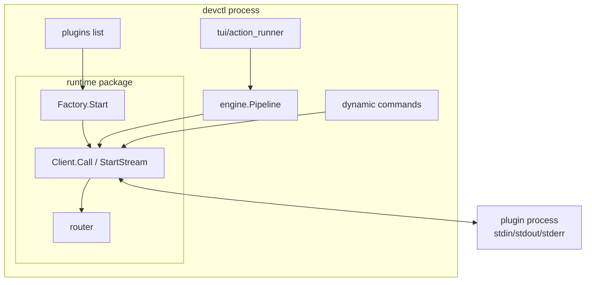
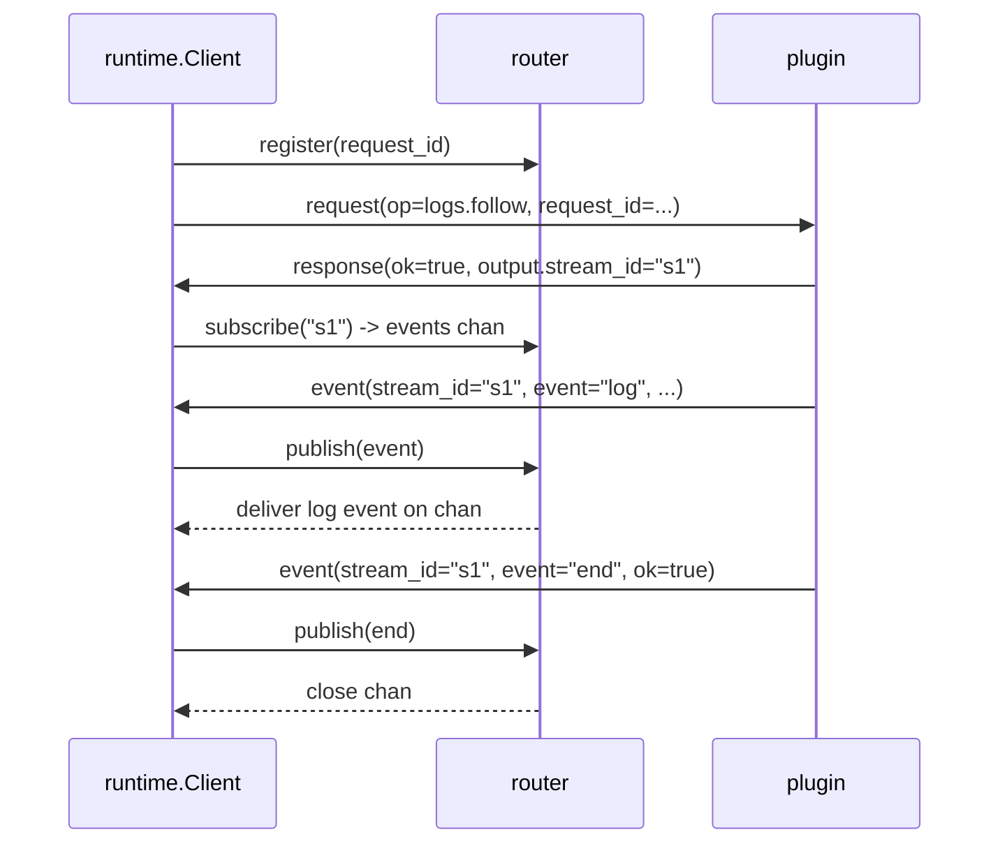

# Runtime client: plugin protocol, ops, streams, and commands

## Goal

Explain (in “textbook” detail) how devctl’s Go backend interacts with plugins:
- what plugins are for,
- what APIs exist (`runtime.Factory`, `runtime.Client`, protocol frames),
- how request/response and streaming are implemented internally,
- how plugin-defined CLI commands work (handshake command specs + `command.run`),
- and which parts of devctl use which parts of the runtime stack.

## Context

### Plugins are “repo-specific brains”; devctl is the orchestrator

devctl is structured so that repo-specific knowledge lives in plugins (often Python), while devctl owns:
- orchestration and ordering (pipeline phases),
- timeouts and cancellation,
- process supervision (services from `launch.plan`),
- persistence (`.devctl/state.json` and logs),
- and user experience (CLI + TUI).

Backend plugin interaction has three layers:
1) **Protocol types** (`devctl/pkg/protocol`): JSON schemas and canonical error codes.
2) **Runtime** (`devctl/pkg/runtime`): start a plugin process, read handshake, send requests, read responses/events.
3) **Consumers**:
   - `engine.Pipeline` for pipeline ops,
   - dynamic CLI commands for plugin-defined subcommands,
   - TUI action runner for “up/down/restart” pipelines (it reuses pipeline + runtime).

### Mental model

- Plugins are separate processes with a strict NDJSON protocol over stdin/stdout.
- devctl “talks” to them by writing request frames to stdin and reading response/event frames from stdout.
- Stderr is allowed for plugin logs; stdout must remain protocol-clean.

#### Diagram: how the pieces fit



## Quick Reference

### 1) Protocol frames (what goes over the wire)

All frames are JSON objects written one-per-line (NDJSON).

#### 1.1 Handshake (first frame on stdout)

Schema: `protocol.Handshake` (`devctl/pkg/protocol/types.go`)

Key fields:
- `type: "handshake"`
- `protocol_version: "v1"`
- `plugin_name: string`
- `capabilities`:
  - `ops: []string` (request ops supported)
  - `streams: []string` (stream names; see below)
  - `commands: []string` (names of plugin-defined CLI commands)

Handshake validation is intentionally minimal (`devctl/pkg/protocol/validate.go`): it does not validate capabilities.

#### 1.2 Request (devctl -> plugin, stdin)

Schema: `protocol.Request`

Important fields:
- `request_id`: unique request identifier (devctl-generated)
- `op`: operation name (string)
- `ctx`: `repo_root`, `cwd`, `deadline_ms`, `dry_run` (best-effort context)
- `input`: op-specific JSON

#### 1.3 Response (plugin -> devctl, stdout)

Schema: `protocol.Response`

Important fields:
- `request_id`: must match request
- `ok: true|false`
- `output`: op-specific JSON on success
- `error`: `{code,message,details}` on failure

Canonical error codes exist in `devctl/pkg/protocol/errors.go`, including `E_UNSUPPORTED` and protocol contamination errors.

#### 1.4 Event (plugin -> devctl, stdout)

Schema: `protocol.Event`

Events belong to a stream:
- `stream_id`: token returned by the stream start op
- `event`: typically `"log"` and `"end"`

### 2) runtime.Factory and runtime.Client (Go API reference)

#### 2.1 `runtime.Factory`

Defined in `devctl/pkg/runtime/factory.go`.

Purpose:
- Start plugin processes with process-group isolation.
- Read and validate the handshake.
- Return a `runtime.Client` that can send requests and read responses/events.

Key API:

```go
type FactoryOptions struct {
  HandshakeTimeout time.Duration
  ShutdownTimeout  time.Duration
}

func NewFactory(opts FactoryOptions) *Factory
func (f *Factory) Start(ctx context.Context, spec PluginSpec) (Client, error)
```

If handshake fails, `Start` terminates the plugin process group.

#### 2.2 `runtime.Client` (interface)

Defined in `devctl/pkg/runtime/client.go`.

```go
type Client interface {
  Spec() PluginSpec
  Handshake() protocol.Handshake
  SupportsOp(op string) bool
  Call(ctx context.Context, op string, input any, output any) error
  StartStream(ctx context.Context, op string, input any) (streamID string, events <-chan protocol.Event, err error)
  Close(ctx context.Context) error
}
```

Key points:
- `SupportsOp` checks membership in `handshake.capabilities.ops`.
- `Call` and `StartStream` enforce capabilities by default; unsupported ops fail fast with `E_UNSUPPORTED` without writing to stdin.
- `Close` terminates the plugin process group.

#### 2.3 Request context construction (repo_root/cwd/dry_run + deadline)

`runtime` builds `protocol.RequestContext` from two sources:
- the call context deadline (`ctx.Deadline()` → `deadline_ms`)
- the client’s explicit request metadata (`runtime.RequestMeta` → `repo_root`/`cwd`/`dry_run`)

Call sites provide request metadata when starting the client:

```go
meta := runtime.RequestMeta{RepoRoot: repoRoot, Cwd: cwd, DryRun: dryRun}
c, err := factory.Start(ctx, spec, runtime.StartOptions{Meta: meta})
```

### 3) How `Call` is implemented (request/response plumbing)

`Call(ctx, op, input, output)` (`devctl/pkg/runtime/client.go`) works like this:

1) Allocate a request ID:
   - `rid := spec.ID + "-" + incrementingCounter`
2) Register `rid` with the router to get a response channel.
3) Marshal `input`, build a `protocol.Request` frame, write it to stdin.
4) Wait for:
   - a response routed by `request_id`, or
   - `ctx.Done()` (deadline/cancel).

#### Concurrency and ordering

- Writes are guarded by a mutex (`writerMu`) so multiple goroutines can call `Call` safely without interleaving NDJSON.
- Read loops run concurrently:
  - stdout loop parses frames and delivers responses/events to the router
  - stderr loop logs each stderr line tagged with plugin id

#### Failure semantics

- If stdout contains invalid JSON or unexpected frame types, the client treats it as fatal:
  - router transitions into a “fatal” state, pending requests fail, stream subscribers close.
- On timeout/cancel, the router sends an internal “canceled” response so the caller returns promptly.

### 4) How streams are implemented (StartStream + router buffering)

Streams in devctl are “request-started, event-driven”:
1) Call a stream-start op with `StartStream(ctx, op, input)`.
2) Plugin responds with `ok=true` and `output.stream_id`.
3) Plugin emits `event` frames with that `stream_id` until it emits `event="end"` (or the plugin exits).

The router (`devctl/pkg/runtime/router.go`) implements:
- response routing by `request_id`
- event routing by `stream_id`
- buffering of events that arrive before a subscriber subscribes

#### Diagram: StartStream flow



### 5) Plugin-defined CLI commands (handshake commands + command.run)

This subsystem lets plugins add CLI subcommands without adding Go code.

#### 5.1 Discovery: handshake `capabilities.commands`

Implementation: `devctl/cmd/devctl/cmds/dynamic_commands.go`.

At startup, devctl:
1) discovers plugin specs from config,
2) starts each plugin,
3) reads handshake `capabilities.commands`,
4) registers Cobra subcommands dynamically.

#### 5.2 Execution: `command.run`

When the user runs a discovered command, devctl:
1) starts the provider plugin,
3) runs a mini-pipeline `config.mutate` to compute config,
4) calls `command.run` with `{name, argv, config}`,
5) expects `output.exit_code` and errors if non-zero.

### 6) Who uses these APIs (by subsystem)

#### 6.1 engine.Pipeline (core phase orchestration)

File: `devctl/pkg/engine/pipeline.go`

Uses:
- `Client.SupportsOp(op)` to gate calls
- `Client.Call(ctx, op, ...)` to run pipeline ops and merge results across plugins

#### 6.2 CLI up/plan/plugins list

Files:
- `devctl/cmd/devctl/cmds/up.go` and `devctl/cmd/devctl/cmds/plan.go`: start clients via `runtime.Factory`, pass them into `engine.Pipeline`
- `devctl/cmd/devctl/cmds/plugins.go`: starts each plugin and prints handshake capabilities

#### 6.3 TUI action runner

File: `devctl/pkg/tui/action_runner.go`

Uses:
- `runtime.Factory` to start plugin clients
- `engine.Pipeline` to execute phases

#### 6.4 Dynamic CLI commands

File: `devctl/cmd/devctl/cmds/dynamic_commands.go`

Uses:
- `runtime.Factory` + handshake `capabilities.commands` at startup
- `Client.Call("command.run")` at runtime for a user-invoked dynamic command

## Usage Examples

### Example 1: Safe pipeline op invocation (pattern in engine)

```go
if c.SupportsOp("validate.run") {
  err := c.Call(ctx, "validate.run", map[string]any{"config": cfg}, &out)
  // handle err
}
```

### Example 2: Starting a stream and consuming events

```go
_, events, err := c.StartStream(ctx, "logs.follow", map[string]any{"service": "backend"})
if err != nil { /* handle */ }
for ev := range events {
  // handle ev.Event == "log" or "end"
}
```

### Example 3: Handshake command specs

Handshake advertises commands as structured specs:

```json
{"type":"handshake","protocol_version":"v2","plugin_name":"example",
 "capabilities":{"ops":["command.run"],
 "commands":[{"name":"db-reset","help":"Reset local DB"}]}}
```

## Related

- Plugin protocol authoring guide: `devctl/pkg/doc/topics/devctl-plugin-authoring.md`
- Capability enforcement design proposal: `devctl/ttmp/2026/01/07/MO-010-DEVCTL-CLEANUP-PASS--devctl-cleanup-pass/design-doc/01-safe-plugin-invocation-and-capability-enforcement-long-term-pattern.md`
